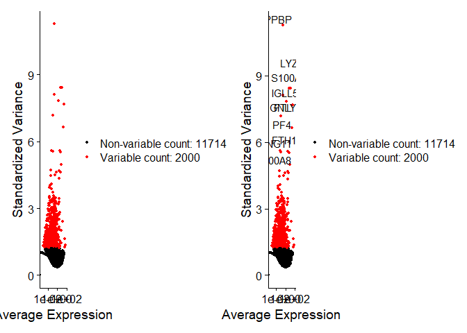

# Seurat tutorial 1 - pbmc3k
Satija lab (original); Scot J Matkovich (notes)

# pbmc3k - guided clustering tutorial

Original sources: [R
markdown](https://github.com/satijalab/seurat/blob/HEAD/vignettes/pbmc3k_tutorial.Rmd)
and [webpage](https://satijalab.org/seurat/articles/pbmc3k_tutorial)

## Set up the Seurat object

For this tutorial, we will be analyzing the a dataset of Peripheral
Blood Mononuclear Cells (PBMC) freely available from 10X Genomics. There
are 2,700 single cells that were sequenced on the Illumina NextSeq
500.  

We start by reading in the data. The Read10X() function reads in the
output of the cellranger pipeline from 10X, returning a unique molecular
identified (UMI) count matrix. The values in this matrix represent the
number of molecules for each feature (i.e. gene; row) that are detected
in each cell (column). Note that more recent versions of cellranger now
also output using the [h5 file
format](https://support.10xgenomics.com/single-cell-gene-expression/software/pipelines/latest/advanced/h5_matrices),
which can be read in using the Read10X_h5() function in Seurat.  

We next use the count matrix to create a Seurat object. The object
serves as a container that contains both data (like the count matrix)
and analysis (like PCA, or clustering results) for a single-cell
dataset. For more information, check out the [GitHub
Wiki](https://github.com/satijalab/seurat/wiki). For example, in Seurat
v5, the count matrix is stored in pbmc\[\[“RNA”\]\]\$counts.

``` r
library(dplyr)
library(Seurat)
library(patchwork)

work.dir <- "C:/Downloads/"
if (!dir.exists(file.path(work.dir,"output"))) dir.create(file.path(work.dir,"output"))

# Load the PBMC dataset
if (!dir.exists(file.path(work.dir,"pbmc3k_filtered_gene_bc_matrices/filtered_gene_bc_matrices/hg19/"))) {
  
  download.file("https://cf.10xgenomics.com/samples/cell/pbmc3k/pbmc3k_filtered_gene_bc_matrices.tar.gz", destfile = file.path(work.dir,"pbmc3k_filtered_gene_bc_matrices.tar.gz"))
  untar(file.path(work.dir,"pbmc3k_filtered_gene_bc_matrices.tar.gz"), exdir = file.path(work.dir,"pbmc3k_filtered_gene_bc_matrices"))
  file.remove(file.path(work.dir,"pbmc3k_filtered_gene_bc_matrices.tar.gz"))
  
}

pbmc.data <- Read10X(data.dir = file.path(work.dir,"pbmc3k_filtered_gene_bc_matrices/filtered_gene_bc_matrices/hg19/"))

# Initialize the Seurat object with the raw (non-normalized data)
# Note the min.cells and min.features arguments - these filter out cells with very low gene counts, as well as genes that are detected in very few cells
pbmc <- CreateSeuratObject(counts = pbmc.data, project = "pbmc3k", min.cells = 3, min.features = 200)
```

    Warning: Feature names cannot have underscores ('_'), replacing with dashes
    ('-')

``` r
# See the object summary
pbmc
```

    An object of class Seurat 
    13714 features across 2700 samples within 1 assay 
    Active assay: RNA (13714 features, 0 variable features)
     1 layer present: counts

### QC and selecting cells for further analysis

Seurat allows you to easily explore QC metrics and filter cells based on
any user-defined criteria. A few QC metrics commonly used by the
community include:

- The number of unique genes detected in each cell.
- Low-quality cells or empty droplets will often have very few genes
- Cell doublets or multiplets may exhibit an aberrantly high gene count
- Similarly, the total number of molecules detected within a cell
  (correlates strongly with unique genes)
- The percentage of reads that map to the mitochondrial genome
- Low-quality / dying cells often exhibit extensive mitochondrial
  contamination
- We calculate mitochondrial QC metrics with the PercentageFeatureSet()
  function, which calculates the percentage of counts originating from a
  set of features
- We use the set of all genes starting with MT- as a set of
  mitochondrial genes

The number of unique genes and total molecules are automatically
calculated during CreateSeuratObject(). You can find them stored in the
object meta data.

In the example below, we visualize QC metrics, and use these to filter
cells. We filter cells that have unique feature counts over 2,500 or
less than 200. We filter cells that have \>5% mitochondrial counts.

``` r
# The [[ operator can add columns to object metadata. This is a great place to stash QC stats
pbmc[["percent.mt"]] <- PercentageFeatureSet(pbmc, pattern = "^MT-")

# Show QC metrics for the first 5 cells
head(pbmc@meta.data, 5)
```

                     orig.ident nCount_RNA nFeature_RNA percent.mt
    AAACATACAACCAC-1     pbmc3k       2419          779  3.0177759
    AAACATTGAGCTAC-1     pbmc3k       4903         1352  3.7935958
    AAACATTGATCAGC-1     pbmc3k       3147         1129  0.8897363
    AAACCGTGCTTCCG-1     pbmc3k       2639          960  1.7430845
    AAACCGTGTATGCG-1     pbmc3k        980          521  1.2244898

``` r
# Visualize QC metrics as a violin plot
VlnPlot(pbmc, features = c("nFeature_RNA", "nCount_RNA", "percent.mt"), ncol = 3)
```

    Warning: Default search for "data" layer in "RNA" assay yielded no results;
    utilizing "counts" layer instead.


``` r
# FeatureScatter is typically used to visualize feature-feature relationships, but can be used
# for anything calculated by the object, i.e. columns in object metadata, PC scores etc.

plot1 <- FeatureScatter(pbmc, feature1 = "nCount_RNA", feature2 = "percent.mt")
plot2 <- FeatureScatter(pbmc, feature1 = "nCount_RNA", feature2 = "nFeature_RNA")
plot1 + plot2
```


``` r
pbmc <- subset(pbmc, subset = nFeature_RNA > 200 & nFeature_RNA < 2500 & percent.mt < 5)
```

### Normalizing the data

After removing unwanted cells from the dataset, the next step is to
normalize the data. By default, we employ a global-scaling normalization
method “LogNormalize” that normalizes the feature expression
measurements for each cell by the total expression, multiplies this by a
scale factor (10,000 by default), and log-transforms the result. In
Seurat v5, Normalized values are stored in `pbmc[["RNA"]]$data`.

``` r
pbmc <- NormalizeData(pbmc, normalization.method = "LogNormalize", scale.factor = 10000)
```

    Normalizing layer: counts

While this method of normalization is standard and widely used in
scRNA-seq analysis, global-scaling relies on an assumption that each
cell originally contains the same number of RNA molecules. We and others
have developed alternative workflows for the single cell preprocessing
that do not make these assumptions. For users who are interested, please
check out our `SCTransform()` normalization workflow. The method is
described in our
[paper](https://genomebiology.biomedcentral.com/articles/10.1186/s13059-021-02584-9),
with a separate vignette using Seurat
[here](https://satijalab.org/seurat/articles/sctransform_vignette). The
use of SCTransform replaces the need to run `NormalizeData`,
`FindVariableFeatures`, or `ScaleData`.

### Identification of highly variable features (feature selection)

We next calculate a subset of features that exhibit high cell-to-cell
variation in the dataset (i.e, they are highly expressed in some cells,
and lowly expressed in others). We and others have found that focusing
on these genes in downstream analysis helps to highlight biological
signal in single-cell datasets.

Our procedure in Seurat is described in detail
[here](https://doi.org/10.1016/j.cell.2019.05.031), and improves on
previous versions by directly modeling the mean-variance relationship
inherent in single-cell data, and is implemented in the
`FindVariableFeatures()` function. By default, we return 2,000 features
per dataset. These will be used in downstream analysis, like PCA.

``` r
pbmc <- FindVariableFeatures(pbmc, selection.method = "vst", nfeatures = 2000)
```

    Finding variable features for layer counts

``` r
# Identify the 10 most highly variable genes
top10 <- head(VariableFeatures(pbmc), 10)

# plot variable features with and without labels
plot3 <- VariableFeaturePlot(pbmc)
plot4 <- LabelPoints(plot = plot3, points = top10, repel = TRUE)
```

    When using repel, set xnudge and ynudge to 0 for optimal results

``` r
plot3 + plot4
```

    Warning in scale_x_log10(): log-10 transformation introduced infinite values.
    log-10 transformation introduced infinite values.



### Scaling the data

Next, we apply a linear transformation (‘scaling’) that is a standard
pre-processing step prior to dimensional reduction techniques like PCA.
The `ScaleData()` function:

- Shifts the expression of each gene, so that the mean expression across
  cells is 0
- Scales the expression of each gene, so that the variance across cells
  is 1
- This step gives equal weight in downstream analyses, so that
  highly-expressed genes do not dominate
- The results of this are stored in `pbmc[["RNA"]]$scale.data`

By default, only variable features are scaled. You can specify the
`features` argument to scale additional features

``` r
all.genes <- rownames(pbmc)
pbmc <- ScaleData(pbmc, features = all.genes)
```

    Centering and scaling data matrix

In Seurat, we also use the `ScaleData()` function to remove unwanted
sources of variation from a single-cell dataset. For example, we could
‘regress out’ heterogeneity associated with (for example) cell cycle
stage, or mitochondrial contamination i.e.:

`pbmc <- ScaleData(pbmc, vars.to.regress = "percent.mt")`

However, particularly for advanced users who would like to use this
functionality, we strongly recommend the use of our new normalization
workflow, `SCTransform()`. The method is described in our paper, with a
separate vignette using Seurat here. As with `ScaleData()`, the function
`SCTransform()` also includes a `vars.to.regress` parameter.

## Perform linear dimensional reduction

Next we perform PCA on the scaled data. By default, only the previously
determined variable features are used as input, but can be defined using
`features` argument if you wish to choose a different subset (if you do
want to use a custom subset of features, make sure you pass these to
`ScaleData` first).

For the first principal components, Seurat outputs a list of genes with
the most positive and negative loadings, representing modules of genes
that exhibit either correlation (or anti-correlation) across single
cells in the dataset.

Seurat provides several useful ways of visualizing both cells and
features that define the PCA, including `VizDimReduction()`,
`DimPlot()`, and `DimHeatmap()`.

``` r
pbmc <- RunPCA(pbmc, features = VariableFeatures(object = pbmc))
```

    PC_ 1 
    Positive:  CST3, TYROBP, LST1, AIF1, FTL, FTH1, LYZ, FCN1, S100A9, TYMP 
           FCER1G, CFD, LGALS1, S100A8, CTSS, LGALS2, SERPINA1, IFITM3, SPI1, CFP 
           PSAP, IFI30, SAT1, COTL1, S100A11, NPC2, GRN, LGALS3, GSTP1, PYCARD 
    Negative:  MALAT1, LTB, IL32, IL7R, CD2, B2M, ACAP1, CD27, STK17A, CTSW 
           CD247, GIMAP5, AQP3, CCL5, SELL, TRAF3IP3, GZMA, MAL, CST7, ITM2A 
           MYC, GIMAP7, HOPX, BEX2, LDLRAP1, GZMK, ETS1, ZAP70, TNFAIP8, RIC3 
    PC_ 2 
    Positive:  CD79A, MS4A1, TCL1A, HLA-DQA1, HLA-DQB1, HLA-DRA, LINC00926, CD79B, HLA-DRB1, CD74 
           HLA-DMA, HLA-DPB1, HLA-DQA2, CD37, HLA-DRB5, HLA-DMB, HLA-DPA1, FCRLA, HVCN1, LTB 
           BLNK, P2RX5, IGLL5, IRF8, SWAP70, ARHGAP24, FCGR2B, SMIM14, PPP1R14A, C16orf74 
    Negative:  NKG7, PRF1, CST7, GZMB, GZMA, FGFBP2, CTSW, GNLY, B2M, SPON2 
           CCL4, GZMH, FCGR3A, CCL5, CD247, XCL2, CLIC3, AKR1C3, SRGN, HOPX 
           TTC38, APMAP, CTSC, S100A4, IGFBP7, ANXA1, ID2, IL32, XCL1, RHOC 
    PC_ 3 
    Positive:  HLA-DQA1, CD79A, CD79B, HLA-DQB1, HLA-DPB1, HLA-DPA1, CD74, MS4A1, HLA-DRB1, HLA-DRA 
           HLA-DRB5, HLA-DQA2, TCL1A, LINC00926, HLA-DMB, HLA-DMA, CD37, HVCN1, FCRLA, IRF8 
           PLAC8, BLNK, MALAT1, SMIM14, PLD4, P2RX5, IGLL5, LAT2, SWAP70, FCGR2B 
    Negative:  PPBP, PF4, SDPR, SPARC, GNG11, NRGN, GP9, RGS18, TUBB1, CLU 
           HIST1H2AC, AP001189.4, ITGA2B, CD9, TMEM40, PTCRA, CA2, ACRBP, MMD, TREML1 
           NGFRAP1, F13A1, SEPT5, RUFY1, TSC22D1, MPP1, CMTM5, RP11-367G6.3, MYL9, GP1BA 
    PC_ 4 
    Positive:  HLA-DQA1, CD79B, CD79A, MS4A1, HLA-DQB1, CD74, HIST1H2AC, HLA-DPB1, PF4, SDPR 
           TCL1A, HLA-DRB1, HLA-DPA1, HLA-DQA2, PPBP, HLA-DRA, LINC00926, GNG11, SPARC, HLA-DRB5 
           GP9, AP001189.4, CA2, PTCRA, CD9, NRGN, RGS18, CLU, TUBB1, GZMB 
    Negative:  VIM, IL7R, S100A6, IL32, S100A8, S100A4, GIMAP7, S100A10, S100A9, MAL 
           AQP3, CD2, CD14, FYB, LGALS2, GIMAP4, ANXA1, CD27, FCN1, RBP7 
           LYZ, S100A11, GIMAP5, MS4A6A, S100A12, FOLR3, TRABD2A, AIF1, IL8, IFI6 
    PC_ 5 
    Positive:  GZMB, NKG7, S100A8, FGFBP2, GNLY, CCL4, CST7, PRF1, GZMA, SPON2 
           GZMH, S100A9, LGALS2, CCL3, CTSW, XCL2, CD14, CLIC3, S100A12, RBP7 
           CCL5, MS4A6A, GSTP1, FOLR3, IGFBP7, TYROBP, TTC38, AKR1C3, XCL1, HOPX 
    Negative:  LTB, IL7R, CKB, VIM, MS4A7, AQP3, CYTIP, RP11-290F20.3, SIGLEC10, HMOX1 
           LILRB2, PTGES3, MAL, CD27, HN1, CD2, GDI2, CORO1B, ANXA5, TUBA1B 
           FAM110A, ATP1A1, TRADD, PPA1, CCDC109B, ABRACL, CTD-2006K23.1, WARS, VMO1, FYB 

``` r
# Examine and visualize PCA results a few different ways
print(pbmc[["pca"]], dims = 1:5, nfeatures = 5)
```

    PC_ 1 
    Positive:  CST3, TYROBP, LST1, AIF1, FTL 
    Negative:  MALAT1, LTB, IL32, IL7R, CD2 
    PC_ 2 
    Positive:  CD79A, MS4A1, TCL1A, HLA-DQA1, HLA-DQB1 
    Negative:  NKG7, PRF1, CST7, GZMB, GZMA 
    PC_ 3 
    Positive:  HLA-DQA1, CD79A, CD79B, HLA-DQB1, HLA-DPB1 
    Negative:  PPBP, PF4, SDPR, SPARC, GNG11 
    PC_ 4 
    Positive:  HLA-DQA1, CD79B, CD79A, MS4A1, HLA-DQB1 
    Negative:  VIM, IL7R, S100A6, IL32, S100A8 
    PC_ 5 
    Positive:  GZMB, NKG7, S100A8, FGFBP2, GNLY 
    Negative:  LTB, IL7R, CKB, VIM, MS4A7 

``` r
VizDimLoadings(pbmc, dims = 1:2, reduction = "pca")
```


``` r
DimPlot(pbmc, reduction = "pca") + NoLegend()
```


In particular `DimHeatmap()` allows for easy exploration of the primary
sources of heterogeneity in a dataset, and can be useful when trying to
decide which PCs to include for further downstream analyses. Both cells
and features are ordered according to their PCA scores. Setting cells to
a number plots the ‘extreme’ cells on both ends of the spectrum, which
dramatically speeds plotting for large datasets. Though clearly a
supervised analysis, we find this to be a valuable tool for exploring
correlated feature sets.

``` r
DimHeatmap(pbmc, dims = 1, cells = 500, balanced = TRUE)
```


``` r
DimHeatmap(pbmc, dims = 1:15, cells = 500, balanced = TRUE)
```


### What is the likely ‘minimal’ dimensionality of the data?

Identifying the true dimensionality of a dataset – can be
challenging/uncertain for the user. We therefore suggest these multiple
approaches for users. The first is more supervised, exploring PCs to
determine relevant sources of heterogeneity, and could be used in
conjunction with GSEA for example. The second (`ElbowPlot`) is shown
below. The third is a heuristic that is commonly used, and can be
calculated instantly. In this example, we might have been justified in
choosing anything between PC 7-12 as a cutoff.

We chose 10 here, but encourage users to consider the following:

- Dendritic cell and NK aficionados may recognize that genes strongly
  associated with PCs 12 and 13 define rare immune subsets (i.e. MZB1 is
  a marker for plasmacytoid DCs). However, these groups are so rare,
  they are difficult to distinguish from background noise for a dataset
  of this size without prior knowledge.
- We encourage users to repeat downstream analyses with a different
  number of PCs (10, 15, or even 50!). As you will observe, the results
  often do not differ dramatically.
- We advise users to err on the higher side when choosing this
  parameter. For example, performing downstream analyses with only 5 PCs
  does significantly and adversely affect results.

``` r
ElbowPlot(pbmc)
```


Identifying the true dimensionality of a dataset – can be
challenging/uncertain for the user. We therefore suggest these multiple
approaches for users. The first is more supervised, exploring PCs to
determine relevant sources of heterogeneity, and could be used in
conjunction with GSEA for example. The second (`ElbowPlot`) The third is
a heuristic that is commonly used, and can be calculated instantly. In
this example, we might have been justified in choosing anything between
PC 7-12 as a cutoff.

We chose 10 here, but encourage users to consider the following:

- Dendritic cell and NK aficionados may recognize that genes strongly
  associated with PCs 12 and 13 define rare immune subsets (i.e. MZB1 is
  a marker for plasmacytoid DCs). However, these groups are so rare,
  they are difficult to distinguish from background noise for a dataset
  of this size without prior knowledge.
- We encourage users to repeat downstream analyses with a different
  number of PCs (10, 15, or even 50!). As you will observe, the results
  often do not differ dramatically.
- We advise users to err on the higher side when choosing this
  parameter. For example, performing downstream analyses with only 5 PCs
  does significantly and adversely affect results.

### Cluster the cells

Seurat applies a graph-based clustering approach, building upon initial
strategies in ([Macosko *et
al*](http://www.cell.com/abstract/S0092-8674(15)00549-8)). Importantly,
the *distance metric* which drives the clustering analysis (based on
previously identified PCs) remains the same. However, our approach to
partitioning the cellular distance matrix into clusters has dramatically
improved. Our approach was heavily inspired by recent manuscripts which
applied graph-based clustering approaches to scRNA-seq data [\[SNN-Cliq,
Xu and Su, Bioinformatics,
2015\]](http://bioinformatics.oxfordjournals.org/content/early/2015/02/10/bioinformatics.btv088.abstract)
and CyTOF data [\[PhenoGraph, Levine *et al*., Cell,
2015\]](http://www.ncbi.nlm.nih.gov/pubmed/26095251). Briefly, these
methods embed cells in a graph structure - for example a K-nearest
neighbor (KNN) graph, with edges drawn between cells with similar
feature expression patterns, and then attempt to partition this graph
into highly interconnected ‘quasi-cliques’ or ‘communities’.

As in PhenoGraph, we first construct a KNN graph based on the euclidean
distance in PCA space, and refine the edge weights between any two cells
based on the shared overlap in their local neighborhoods (Jaccard
similarity). This step is performed using the `FindNeighbors()`
function, and takes as input the previously defined dimensionality of
the dataset (first 10 PCs).

To cluster the cells, we next apply modularity optimization techniques
such as the Louvain algorithm (default) or SLM [\[SLM, Blondel *et al*.,
Journal of Statistical
Mechanics\]](http://dx.doi.org/10.1088/1742-5468/2008/10/P10008), to
iteratively group cells together, with the goal of optimizing the
standard modularity function. The `FindClusters()` function implements
this procedure, and contains a resolution parameter that sets the
‘granularity’ of the downstream clustering, with increased values
leading to a greater number of clusters. We find that setting this
parameter between 0.4-1.2 typically returns good results for single-cell
datasets of around 3K cells. Optimal resolution often increases for
larger datasets. The clusters can be found using the `Idents()`
function.

``` r
pbmc <- FindNeighbors(pbmc, dims = 1:10)
```

    Computing nearest neighbor graph

    Computing SNN

``` r
pbmc <- FindClusters(pbmc, resolution = 0.5)
```

    Modularity Optimizer version 1.3.0 by Ludo Waltman and Nees Jan van Eck

    Number of nodes: 2638
    Number of edges: 95927

    Running Louvain algorithm...
    Maximum modularity in 10 random starts: 0.8728
    Number of communities: 9
    Elapsed time: 0 seconds

``` r
# Look at cluster IDs of the first 5 cells
head(Idents(pbmc), 5)
```

    AAACATACAACCAC-1 AAACATTGAGCTAC-1 AAACATTGATCAGC-1 AAACCGTGCTTCCG-1 
                   2                3                2                1 
    AAACCGTGTATGCG-1 
                   6 
    Levels: 0 1 2 3 4 5 6 7 8

### Run non-linear dimensional reduction (UMAP/tSNE)

Seurat offers several non-linear dimensional reduction techniques, such
as tSNE and UMAP, to visualize and explore these datasets. The goal of
these algorithms is to learn underlying structure in the dataset, in
order to place similar cells together in low-dimensional space.
Therefore, cells that are grouped together within graph-based clusters
determined above should co-localize on these dimension reduction plots.

While we and others have routinely found 2D visualization techniques
like tSNE and UMAP to be valuable tools for exploring datasets, all
visualization techniques have limitations, and cannot fully represent
the complexity of the underlying data. In particular, these methods aim
to preserve local distances in the dataset (i.e. ensuring that cells
with very similar gene expression profiles co-localize), but often do
not preserve more global relationships. We encourage users to leverage
techniques like UMAP for visualization, but to avoid drawing biological
conclusions solely on the basis of visualization techniques.

``` r
pbmc <- RunUMAP(pbmc, dims = 1:10)
```

    Warning: The default method for RunUMAP has changed from calling Python UMAP via reticulate to the R-native UWOT using the cosine metric
    To use Python UMAP via reticulate, set umap.method to 'umap-learn' and metric to 'correlation'
    This message will be shown once per session

    09:30:24 UMAP embedding parameters a = 0.9922 b = 1.112

    09:30:24 Read 2638 rows and found 10 numeric columns

    09:30:24 Using Annoy for neighbor search, n_neighbors = 30

    09:30:24 Building Annoy index with metric = cosine, n_trees = 50

    0%   10   20   30   40   50   60   70   80   90   100%

    [----|----|----|----|----|----|----|----|----|----|

    **************************************************|
    09:30:24 Writing NN index file to temp file C:\Users\sjmat\AppData\Local\Temp\RtmpK6D4qX\file50447c376827
    09:30:24 Searching Annoy index using 1 thread, search_k = 3000
    09:30:26 Annoy recall = 100%
    09:30:26 Commencing smooth kNN distance calibration using 1 thread with target n_neighbors = 30
    09:30:27 Initializing from normalized Laplacian + noise (using RSpectra)
    09:30:27 Commencing optimization for 500 epochs, with 105140 positive edges
    09:30:37 Optimization finished

``` r
# note that you can set `label = TRUE` or use the LabelClusters function to help label individual clusters
DimPlot(pbmc, reduction = 'umap')
```


You can save the object at this point so that it can easily be loaded
back in without having to rerun the computationally intensive steps
performed above, or easily shared with collaborators.

``` r
saveRDS(pbmc, file = file.path(work.dir,"output/pbmc3k_tutorial.rds"))
```

## Finding differentially expressed features (cluster biomarkers)

Seurat can help you find markers that define clusters via differential
expression (DE). By default, it identifies positive and negative markers
of a single cluster (specified in `ident.1`), compared to all other
cells. `FindAllMarkers()` automates this process for all clusters, but
you can also test groups of clusters vs. each other, or against all
cells.

In Seurat v5, we use the presto package (as described
[here](https://www.biorxiv.org/content/10.1101/653253v1) and available
for installation [here](https://github.com/immunogenomics/presto)), to
dramatically improve the speed of DE analysis, particularly for large
datasets. For users who are not using presto, you can examine the
documentation for this function (`?FindMarkers`) to explore the
`min.pct` and `logfc.threshold` parameters, which can be increased in
order to increase the speed of DE testing.

``` r
# find all markers of cluster 2
cluster2.markers <- FindMarkers(pbmc, ident.1 = 2)
head(cluster2.markers, n = 5)
```

                p_val avg_log2FC pct.1 pct.2    p_val_adj
    IL32 2.892340e-90  1.3070772 0.947 0.465 3.966555e-86
    LTB  1.060121e-86  1.3312674 0.981 0.643 1.453850e-82
    CD3D 8.794641e-71  1.0597620 0.922 0.432 1.206097e-66
    IL7R 3.516098e-68  1.4377848 0.750 0.326 4.821977e-64
    LDHB 1.642480e-67  0.9911924 0.954 0.614 2.252497e-63

``` r
# find all markers distinguishing cluster 5 from clusters 0 and 3
cluster5.markers <- FindMarkers(pbmc, ident.1 = 5, ident.2 = c(0, 3))
head(cluster5.markers, n = 5)
```

                          p_val avg_log2FC pct.1 pct.2     p_val_adj
    FCGR3A        8.246578e-205   6.794969 0.975 0.040 1.130936e-200
    IFITM3        1.677613e-195   6.192558 0.975 0.049 2.300678e-191
    CFD           2.401156e-193   6.015172 0.938 0.038 3.292945e-189
    CD68          2.900384e-191   5.530330 0.926 0.035 3.977587e-187
    RP11-290F20.3 2.513244e-186   6.297999 0.840 0.017 3.446663e-182

``` r
# find markers for every cluster compared to all remaining cells, report only the positive ones with at least 2-fold difference
pbmc.markers <- FindAllMarkers(pbmc, only.pos = TRUE)
```

    Calculating cluster 0

    Calculating cluster 1

    Calculating cluster 2

    Calculating cluster 3

    Calculating cluster 4

    Calculating cluster 5

    Calculating cluster 6

    Calculating cluster 7

    Calculating cluster 8

``` r
pbmc.markers |> 
    group_by(cluster) |>
    dplyr::filter(avg_log2FC > 1)
```

    # A tibble: 7,019 × 7
    # Groups:   cluster [9]
           p_val avg_log2FC pct.1 pct.2 p_val_adj cluster gene     
           <dbl>      <dbl> <dbl> <dbl>     <dbl> <fct>   <chr>    
     1 3.75e-112       1.21 0.912 0.592 5.14e-108 0       LDHB     
     2 9.57e- 88       2.40 0.447 0.108 1.31e- 83 0       CCR7     
     3 1.15e- 76       1.06 0.845 0.406 1.58e- 72 0       CD3D     
     4 1.12e- 54       1.04 0.731 0.4   1.54e- 50 0       CD3E     
     5 1.35e- 51       2.14 0.342 0.103 1.86e- 47 0       LEF1     
     6 1.94e- 47       1.20 0.629 0.359 2.66e- 43 0       NOSIP    
     7 2.81e- 44       1.53 0.443 0.185 3.85e- 40 0       PIK3IP1  
     8 6.27e- 43       1.99 0.33  0.112 8.60e- 39 0       PRKCQ-AS1
     9 1.16e- 40       2.70 0.2   0.04  1.59e- 36 0       FHIT     
    10 1.34e- 34       1.96 0.268 0.087 1.84e- 30 0       MAL      
    # ℹ 7,009 more rows

Seurat has several tests for differential expression which can be set
with the test.use parameter (see our [DE vignette](de_vignette.html) for
details). For example, the ROC test returns the ‘classification power’
for any individual marker (ranging from 0 - random, to 1 - perfect).

Note the difference in the structure of the `cluster0.markers` object
resulting from the ROC test compared to the previous `cluster2.markers`
and `cluster5.markers` objects.

``` r
cluster0.markers <- FindMarkers(pbmc, ident.1 = 0, logfc.threshold = 0.25, test.use = "roc", only.pos = TRUE)
head(cluster0.markers, n = 5)
```

          myAUC  avg_diff power avg_log2FC pct.1 pct.2
    RPS12 0.827 0.5059247 0.654  0.7387061 1.000 0.991
    RPS6  0.826 0.4762402 0.652  0.6934523 1.000 0.995
    RPS27 0.824 0.5047203 0.648  0.7372604 0.999 0.992
    RPL32 0.821 0.4294911 0.642  0.6266075 0.999 0.995
    RPS14 0.811 0.4334133 0.622  0.6336957 1.000 0.994

We include several tools for visualizing marker expression. `VlnPlot()`
(shows expression probability distributions across clusters), and
`FeaturePlot()` (visualizes feature expression on a tSNE or PCA plot)
are our most commonly used visualizations. **We also suggest exploring
`RidgePlot()`, `CellScatter()`, and `DotPlot()`** as additional methods
to view your dataset.

``` r
VlnPlot(pbmc, features = c("MS4A1", "CD79A"))
```


``` r
# you can plot raw counts as well
VlnPlot(pbmc, features = c("NKG7", "PF4"), slot = 'counts', log = TRUE)
```

    Warning: The `slot` argument of `VlnPlot()` is deprecated as of Seurat 5.0.0.
    ℹ Please use the `layer` argument instead.


``` r
FeaturePlot(pbmc, features = c("MS4A1", "GNLY", "CD3E", "CD14", "FCER1A", "FCGR3A", "LYZ", "PPBP", "CD8A"))
```


`DoHeatmap()` generates an expression heatmap for given cells and
features. In this case, we are plotting the top 20 markers (or all
markers if less than 20) for each cluster. Note that the markers are
filtered for at least 2-fold differences.

``` r
pbmc.markers |> 
    group_by(cluster) |> 
    dplyr::filter(avg_log2FC > 1) |> 
    slice_head(n = 10)|> 
    ungroup() -> top10
DoHeatmap(pbmc, features = top10$gene) + NoLegend()
```


### Assigning cell type identity to clusters

Fortunately in the case of this dataset, we can use canonical markers to
easily match the unbiased clustering to known cell types:

| Cluster ID | Markers       | Cell Type    |
|------------|---------------|--------------|
| 0          | IL7R, CCR7    | Naive CD4+ T |
| 1          | CD14, LYZ     | CD14+ Mono   |
| 2          | IL7R, S100A4  | Memory CD4+  |
| 3          | MS4A1         | B            |
| 4          | CD8A          | CD8+ T       |
| 5          | FCGR3A, MS4A7 | FCGR3A+ Mono |
| 6          | GNLY, NKG7    | NK           |
| 7          | FCER1A, CST3  | DC           |
| 8          | PPBP          | Platelet     |

``` r
new.cluster.ids <- c("Naive CD4 T", "CD14+ Mono", "Memory CD4 T", "B", "CD8 T", "FCGR3A+ Mono", "NK", "DC", "Platelet")
names(new.cluster.ids) <- levels(pbmc)
pbmc <- RenameIdents(pbmc, new.cluster.ids)
DimPlot(pbmc, reduction = 'umap', label = TRUE, pt.size = 0.5) + NoLegend()
```


The above plot could be modified using `ggplot2` parameters and saved as
a graphic file.

``` r
library(ggplot2)
plot <- DimPlot(pbmc, reduction = "umap", label = TRUE, label.size = 4.5) + xlab("UMAP 1") + ylab("UMAP 2") + 
  theme(axis.title = element_text(size = 18), legend.text = element_text(size = 18)) + 
  guides(colour = guide_legend(override.aes = list(size = 10)))
ggsave(filename = file.path(work.dir,"output/pbmc3k_umap.jpg"), height = 7, width = 12, plot = plot, quality = 50)
```

All the calculations and modifications performed to the Seurat object
could be saved to facilitate future work.

``` r
saveRDS(pbmc, file = file.path(work.dir,"output/pbmc3k_final.rds"))
```

<details>
<summary>
**Session Info**
</summary>

``` r
sessionInfo()
```

    R version 4.4.0 (2024-04-24 ucrt)
    Platform: x86_64-w64-mingw32/x64
    Running under: Windows 11 x64 (build 22631)

    Matrix products: default


    locale:
    [1] LC_COLLATE=English_United States.utf8 
    [2] LC_CTYPE=English_United States.utf8   
    [3] LC_MONETARY=English_United States.utf8
    [4] LC_NUMERIC=C                          
    [5] LC_TIME=English_United States.utf8    

    time zone: America/Indianapolis
    tzcode source: internal

    attached base packages:
    [1] stats     graphics  grDevices utils     datasets  methods   base     

    other attached packages:
    [1] patchwork_1.2.0    Seurat_5.1.0       SeuratObject_5.0.2 sp_2.1-4          
    [5] dplyr_1.1.4       

    loaded via a namespace (and not attached):
      [1] RColorBrewer_1.1-3     rstudioapi_0.16.0      jsonlite_1.8.8        
      [4] magrittr_2.0.3         spatstat.utils_3.0-5   ggbeeswarm_0.7.2      
      [7] farver_2.1.2           rmarkdown_2.27         vctrs_0.6.5           
     [10] ROCR_1.0-11            spatstat.explore_3.3-1 htmltools_0.5.8.1     
     [13] sctransform_0.4.1      parallelly_1.38.0      KernSmooth_2.23-24    
     [16] htmlwidgets_1.6.4      ica_1.0-3              plyr_1.8.9            
     [19] plotly_4.10.4          zoo_1.8-12             igraph_2.0.3          
     [22] mime_0.12              lifecycle_1.0.4        pkgconfig_2.0.3       
     [25] Matrix_1.7-0           R6_2.5.1               fastmap_1.2.0         
     [28] fitdistrplus_1.2-1     future_1.34.0          shiny_1.9.1           
     [31] digest_0.6.36          colorspace_2.1-1       tensor_1.5            
     [34] RSpectra_0.16-2        irlba_2.3.5.1          labeling_0.4.3        
     [37] progressr_0.14.0       fansi_1.0.6            spatstat.sparse_3.1-0 
     [40] httr_1.4.7             polyclip_1.10-7        abind_1.4-5           
     [43] compiler_4.4.0         withr_3.0.1            fastDummies_1.7.3     
     [46] R.utils_2.12.3         MASS_7.3-61            tools_4.4.0           
     [49] vipor_0.4.7            lmtest_0.9-40          beeswarm_0.4.0        
     [52] httpuv_1.6.15          future.apply_1.11.2    goftest_1.2-3         
     [55] R.oo_1.26.0            glue_1.7.0             nlme_3.1-165          
     [58] promises_1.3.0         grid_4.4.0             Rtsne_0.17            
     [61] cluster_2.1.6          reshape2_1.4.4         generics_0.1.3        
     [64] gtable_0.3.5           spatstat.data_3.1-2    R.methodsS3_1.8.2     
     [67] tidyr_1.3.1            data.table_1.15.4      utf8_1.2.4            
     [70] spatstat.geom_3.3-2    RcppAnnoy_0.0.22       ggrepel_0.9.5         
     [73] RANN_2.6.1             pillar_1.9.0           stringr_1.5.1         
     [76] spam_2.10-0            RcppHNSW_0.6.0         limma_3.61.9          
     [79] later_1.3.2            splines_4.4.0          lattice_0.22-6        
     [82] survival_3.7-0         deldir_2.0-4           tidyselect_1.2.1      
     [85] miniUI_0.1.1.1         pbapply_1.7-2          knitr_1.48            
     [88] gridExtra_2.3          scattermore_1.2        xfun_0.46             
     [91] statmod_1.5.0          matrixStats_1.3.0      stringi_1.8.4         
     [94] lazyeval_0.2.2         yaml_2.3.10            evaluate_0.24.0       
     [97] codetools_0.2-20       tibble_3.2.1           cli_3.6.3             
    [100] uwot_0.2.2             xtable_1.8-4           reticulate_1.38.0     
    [103] munsell_0.5.1          Rcpp_1.0.13            globals_0.16.3        
    [106] spatstat.random_3.3-1  png_0.1-8              ggrastr_1.0.2         
    [109] spatstat.univar_3.0-0  parallel_4.4.0         ggplot2_3.5.1         
    [112] presto_1.0.0           dotCall64_1.1-1        listenv_0.9.1         
    [115] viridisLite_0.4.2      scales_1.3.0           ggridges_0.5.6        
    [118] leiden_0.4.3.1         purrr_1.0.2            rlang_1.1.4           
    [121] cowplot_1.1.3         

</details>
