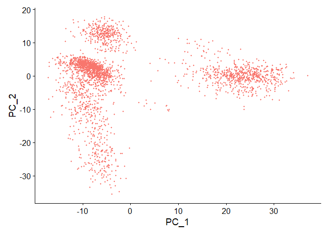

# Seurat tutorial 1 - pbmc3k - with new sctransform steps
Satija lab (original); Scot J Matkovich (notes)

# pbmc3k - guided clustering tutorial

Original sources: [R
markdown](https://github.com/satijalab/seurat/blob/HEAD/vignettes/pbmc3k_tutorial.Rmd)
and [webpage](https://satijalab.org/seurat/articles/pbmc3k_tutorial).
The recommended new `sctransform` steps to replace `NormalizeData`,
`FindVariableFeatures` and `ScaleData` were derived from this [R
markdown](https://github.com/satijalab/seurat/blob/HEAD/vignettes/sctransform_vignette.Rmd)
and associated
[webpage](https://satijalab.org/seurat/articles/sctransform_vignette).

## Set up the Seurat object

For this tutorial, we will be analyzing the a dataset of Peripheral
Blood Mononuclear Cells (PBMC) freely available from 10X Genomics. There
are 2,700 single cells that were sequenced on the Illumina NextSeq
500.  

We start by reading in the data. The `Read10X()` function reads in the
output of the cellranger pipeline from 10X, returning a unique molecular
identified (UMI) count matrix. The values in this matrix represent the
number of molecules for each feature (i.e. gene; row) that are detected
in each cell (column). Note that more recent versions of cellranger now
also output using the [h5 file
format](https://support.10xgenomics.com/single-cell-gene-expression/software/pipelines/latest/advanced/h5_matrices),
which can be read in using the `Read10X_h5()` function in Seurat.  

We next use the count matrix to create a Seurat object. The object
serves as a container that contains both data (like the count matrix)
and analysis (like PCA, or clustering results) for a single-cell
dataset. For more information, check out the [GitHub
Wiki](https://github.com/satijalab/seurat/wiki). For example, in Seurat
v5, the count matrix is stored in pbmc\[\[“RNA”\]\]\$counts.

``` r
library(dplyr)
library(Seurat)
library(patchwork)

work.dir <- "C:/Downloads/"
if (!dir.exists(file.path(work.dir,"output"))) dir.create(file.path(work.dir,"output"))

# Load the PBMC dataset
if (!dir.exists(file.path(work.dir,"pbmc3k_filtered_gene_bc_matrices/filtered_gene_bc_matrices/hg19/"))) {
  
  download.file("https://cf.10xgenomics.com/samples/cell/pbmc3k/pbmc3k_filtered_gene_bc_matrices.tar.gz", destfile = file.path(work.dir,"pbmc3k_filtered_gene_bc_matrices.tar.gz"))
  untar(file.path(work.dir,"pbmc3k_filtered_gene_bc_matrices.tar.gz"), exdir = file.path(work.dir,"pbmc3k_filtered_gene_bc_matrices"))
  file.remove(file.path(work.dir,"pbmc3k_filtered_gene_bc_matrices.tar.gz"))
  
}

pbmc.data <- Read10X(data.dir = file.path(work.dir,"pbmc3k_filtered_gene_bc_matrices/filtered_gene_bc_matrices/hg19/"))

# Initialize the Seurat object with the raw (non-normalized data)
# Note the min.cells and min.features arguments - these filter out cells with very low gene counts, as well as genes that are detected in very few cells
pbmc <- CreateSeuratObject(counts = pbmc.data, project = "pbmc3k", min.cells = 3, min.features = 200)
```

    Warning: Feature names cannot have underscores ('_'), replacing with dashes
    ('-')

``` r
# See the object summary
pbmc
```

    An object of class Seurat 
    13714 features across 2700 samples within 1 assay 
    Active assay: RNA (13714 features, 0 variable features)
     1 layer present: counts

### QC and selecting cells for further analysis

Seurat allows you to easily explore QC metrics and filter cells based on
any user-defined criteria. A few QC metrics commonly used by the
community include:

- The number of unique genes detected in each cell.
- Low-quality cells or empty droplets will often have very few genes
- Cell doublets or multiplets may exhibit an aberrantly high gene count
- Similarly, the total number of molecules detected within a cell
  (correlates strongly with unique genes)
- The percentage of reads that map to the mitochondrial genome
- Low-quality / dying cells often exhibit extensive mitochondrial
  contamination
- We calculate mitochondrial QC metrics with the PercentageFeatureSet()
  function, which calculates the percentage of counts originating from a
  set of features
- We use the set of all genes starting with MT- as a set of
  mitochondrial genes

The number of unique genes and total molecules are automatically
calculated during CreateSeuratObject(). You can find them stored in the
object meta data.

In the example below, we visualize QC metrics, and use these to filter
cells. We filter cells that have unique feature counts over 2,500 or
less than 200. We filter cells that have \>5% mitochondrial counts.

``` r
# The [[ operator can add columns to object metadata. This is a great place to stash QC stats
pbmc[["percent.mt"]] <- PercentageFeatureSet(pbmc, pattern = "^MT-")

# Show QC metrics for the first 5 cells
head(pbmc@meta.data, 5)
```

                     orig.ident nCount_RNA nFeature_RNA percent.mt
    AAACATACAACCAC-1     pbmc3k       2419          779  3.0177759
    AAACATTGAGCTAC-1     pbmc3k       4903         1352  3.7935958
    AAACATTGATCAGC-1     pbmc3k       3147         1129  0.8897363
    AAACCGTGCTTCCG-1     pbmc3k       2639          960  1.7430845
    AAACCGTGTATGCG-1     pbmc3k        980          521  1.2244898

``` r
# Visualize QC metrics as a violin plot
VlnPlot(pbmc, features = c("nFeature_RNA", "nCount_RNA", "percent.mt"), ncol = 3)
```

    Warning: Default search for "data" layer in "RNA" assay yielded no results;
    utilizing "counts" layer instead.


``` r
# FeatureScatter is typically used to visualize feature-feature relationships, but can be used
# for anything calculated by the object, i.e. columns in object metadata, PC scores etc.

plot1 <- FeatureScatter(pbmc, feature1 = "nCount_RNA", feature2 = "percent.mt")
plot2 <- FeatureScatter(pbmc, feature1 = "nCount_RNA", feature2 = "nFeature_RNA")
plot1 + plot2
```


``` r
pbmc <- subset(pbmc, subset = nFeature_RNA > 200 & nFeature_RNA < 2500 & percent.mt < 5)
```

### sctransform to replace previous normalization, variable feature and scaling steps

- Note that this single command replaces `NormalizeData()`,
  `ScaleData()`, and `FindVariableFeatures()`.
- Transformed data will be available in the SCT assay, which is set as
  the default after running sctransform
- During normalization, we can also remove confounding sources of
  variation, for example, mitochondrial mapping percentage
- In Seurat v5, SCT v2 is applied by default. You can revert to v1 by
  setting `vst.flavor = 'v1'`
- The
  [glmGamPoi](https://bioconductor.org/packages/release/bioc/html/glmGamPoi.html)
  package substantially improves speed and is used by default if
  installed, with instructions [here](install.html)

``` r
# run sctransform
pbmc <- SCTransform(pbmc, vars.to.regress = "percent.mt", verbose = TRUE)
```

    Running SCTransform on assay: RNA

    Running SCTransform on layer: counts

    vst.flavor='v2' set. Using model with fixed slope and excluding poisson genes.

    Variance stabilizing transformation of count matrix of size 12519 by 2638

    Model formula is y ~ log_umi

    Get Negative Binomial regression parameters per gene

    Using 2000 genes, 2638 cells

    Found 57 outliers - those will be ignored in fitting/regularization step

    Second step: Get residuals using fitted parameters for 12519 genes

    Computing corrected count matrix for 12519 genes

    Calculating gene attributes

    Wall clock passed: Time difference of 54.66078 secs

    Determine variable features

    Regressing out percent.mt

    Centering data matrix

    Set default assay to SCT

## Perform linear dimensional reduction

Seurat provides several useful ways of visualizing both cells and
features that define the PCA, including `VizDimReduction()`,
`DimPlot()`, and `DimHeatmap()`. In particular `DimHeatmap()` allows for
easy exploration of the primary sources of heterogeneity in a dataset,
and can be useful when trying to decide which PCs to include for further
downstream analyses. Both cells and features are ordered according to
their PCA scores. Setting cells to a number plots the ‘extreme’ cells on
both ends of the spectrum, which dramatically speeds plotting for large
datasets. Though clearly a supervised analysis, we find this to be a
valuable tool for exploring correlated feature sets.

### PCA

``` r
# perform dimensionality reduction by PCA and UMAP embedding
# These are now standard steps in the Seurat workflow for visualization and clustering
pbmc <- RunPCA(pbmc, verbose = FALSE)

# Examine and visualize PCA results a few different ways
print(pbmc[["pca"]], dims = 1:5, nfeatures = 5)
```

    PC_ 1 
    Positive:  FTL, LYZ, FTH1, CST3, S100A9 
    Negative:  MALAT1, RPS27A, CCL5, LTB, RPS6 
    PC_ 2 
    Positive:  HLA-DRA, CD74, CD79A, HLA-DPB1, HLA-DQA1 
    Negative:  NKG7, CCL5, GZMB, GNLY, GZMA 
    PC_ 3 
    Positive:  CD74, HLA-DRA, CD79A, HLA-DPB1, HLA-DQA1 
    Negative:  S100A8, S100A9, LYZ, RPS12, FTL 
    PC_ 4 
    Positive:  FCGR3A, LST1, FCER1G, AIF1, IFITM3 
    Negative:  S100A8, S100A9, LYZ, LGALS2, CD14 
    PC_ 5 
    Positive:  GNLY, GZMB, FGFBP2, FCGR3A, PRF1 
    Negative:  CCL5, GPX1, PPBP, PF4, SDPR 

``` r
VizDimLoadings(pbmc, dims = 1:2, reduction = "pca")
```


``` r
DimPlot(pbmc, reduction = "pca") + NoLegend()
```



``` r
DimHeatmap(pbmc, dims = 1, cells = 500, balanced = TRUE)
```


``` r
DimHeatmap(pbmc, dims = 1:15, cells = 500, balanced = TRUE)
```


### What is the likely ‘minimal’ dimensionality of the data?

Identifying the true dimensionality of a dataset – can be
challenging/uncertain for the user. We therefore suggest these multiple
approaches for users. The first is more supervised, exploring PCs to
determine relevant sources of heterogeneity, and could be used in
conjunction with GSEA for example. The second (`ElbowPlot`) is shown
below. The third is a heuristic that is commonly used, and can be
calculated instantly. In this example, we might have been justified in
choosing anything between PC 7-12 as a cutoff.

We chose 10 here, but encourage users to consider the following:

- Dendritic cell and NK aficionados may recognize that genes strongly
  associated with PCs 12 and 13 define rare immune subsets (i.e. MZB1 is
  a marker for plasmacytoid DCs). However, these groups are so rare,
  they are difficult to distinguish from background noise for a dataset
  of this size without prior knowledge.
- We encourage users to repeat downstream analyses with a different
  number of PCs (10, 15, or even 50!). As you will observe, the results
  often do not differ dramatically.
- We advise users to err on the higher side when choosing this
  parameter. For example, performing downstream analyses with only 5 PCs
  does significantly and adversely affect results.

``` r
ElbowPlot(pbmc)
```


## Run non-linear dimensional reduction (UMAP)

### UMAP

Seurat offers several non-linear dimensional reduction techniques, such
as tSNE and UMAP, to visualize and explore these datasets. The goal of
these algorithms is to learn underlying structure in the dataset, in
order to place similar cells together in low-dimensional space.
Therefore, cells that are grouped together within graph-based clusters
determined above should co-localize on these dimension reduction plots.

While we and others have routinely found 2D visualization techniques
like tSNE and UMAP to be valuable tools for exploring datasets, all
visualization techniques have limitations, and cannot fully represent
the complexity of the underlying data. In particular, these methods aim
to preserve local distances in the dataset (i.e. ensuring that cells
with very similar gene expression profiles co-localize), but often do
not preserve more global relationships. We encourage users to leverage
techniques like UMAP for visualization, but to avoid drawing biological
conclusions solely on the basis of visualization techniques.

### Cluster the cells

Seurat applies a graph-based clustering approach, building upon initial
strategies in ([Macosko *et
al*](http://www.cell.com/abstract/S0092-8674(15)00549-8)). Importantly,
the *distance metric* which drives the clustering analysis (based on
previously identified PCs) remains the same. However, our approach to
partitioning the cellular distance matrix into clusters has dramatically
improved. Our approach was heavily inspired by recent manuscripts which
applied graph-based clustering approaches to scRNA-seq data [\[SNN-Cliq,
Xu and Su, Bioinformatics,
2015\]](http://bioinformatics.oxfordjournals.org/content/early/2015/02/10/bioinformatics.btv088.abstract)
and CyTOF data [\[PhenoGraph, Levine *et al*., Cell,
2015\]](http://www.ncbi.nlm.nih.gov/pubmed/26095251). Briefly, these
methods embed cells in a graph structure - for example a K-nearest
neighbor (KNN) graph, with edges drawn between cells with similar
feature expression patterns, and then attempt to partition this graph
into highly interconnected ‘quasi-cliques’ or ‘communities’.

As in PhenoGraph, we first construct a KNN graph based on the euclidean
distance in PCA space, and refine the edge weights between any two cells
based on the shared overlap in their local neighborhoods (Jaccard
similarity). This step is performed using the `FindNeighbors()`
function, and takes as input the previously defined dimensionality of
the dataset (first 10 PCs).

To cluster the cells, we next apply modularity optimization techniques
such as the Louvain algorithm (default) or SLM [\[SLM, Blondel *et al*.,
Journal of Statistical
Mechanics\]](http://dx.doi.org/10.1088/1742-5468/2008/10/P10008), to
iteratively group cells together, with the goal of optimizing the
standard modularity function. The `FindClusters()` function implements
this procedure, and contains a resolution parameter that sets the
‘granularity’ of the downstream clustering, with increased values
leading to a greater number of clusters. We find that setting this
parameter between 0.4-1.2 typically returns good results for single-cell
datasets of around 3K cells. Optimal resolution often increases for
larger datasets. The clusters can be found using the `Idents()`
function.

``` r
pbmc <- RunUMAP(pbmc, dims = 1:30, verbose = FALSE)
```

    Warning: The default method for RunUMAP has changed from calling Python UMAP via reticulate to the R-native UWOT using the cosine metric
    To use Python UMAP via reticulate, set umap.method to 'umap-learn' and metric to 'correlation'
    This message will be shown once per session

``` r
pbmc <- FindNeighbors(pbmc, dims = 1:30, verbose = FALSE)
pbmc <- FindClusters(pbmc, verbose = FALSE)

DimPlot(pbmc, reduction="umap", label = TRUE) 
```


### Improvements with sctransform

<details>
<summary>
**Why can we choose more PCs when using sctransform?**
</summary>

In the [standard Seurat workflow](pbmc3k_tutorial.html) we focus on 10
PCs for this dataset, though we highlight that the results are similar
with higher settings for this parameter. Interestingly, we’ve found that
when using sctransform, we often benefit by pushing this parameter even
higher. We believe this is because the sctransform workflow performs
more effective normalization, strongly removing technical effects from
the data.

Even after standard log-normalization, variation in sequencing depth is
still a confounding factor (see [Figure
1](https://genomebiology.biomedcentral.com/articles/10.1186/s13059-019-1874-1)),
and this effect can subtly influence higher PCs. In sctransform, this
effect is substantially mitigated (see [Figure
3](https://genomebiology.biomedcentral.com/articles/10.1186/s13059-019-1874-1)).
This means that higher PCs are more likely to represent subtle, but
biologically relevant, sources of heterogeneity – so including them may
improve downstream analysis.

In addition, sctransform returns 3,000 variable features by default,
instead of 2,000. The rationale is similar, the additional variable
features are less likely to be driven by technical differences across
cells, and instead may represent more subtle biological fluctuations. In
general, we find that results produced with sctransform are less
dependent on these parameters (indeed, we achieve nearly identical
results when using all genes in the transcriptome, though this does
reduce computational efficiency). This can help users generate more
robust results, and in addition, enables the application of standard
analysis pipelines with identical parameter settings that can quickly be
applied to new datasets:

For example, the following code replicates the full end-to-end workflow,
in a single command:

``` r
pbmc <- CreateSeuratObject(pbmc_data) |>  PercentageFeatureSet(pattern = "^MT-",col.name = 'percent.mt') |>  SCTransform(vars.to.regress = 'percent.mt') |> 
  RunPCA() |>  FindNeighbors(dims = 1:30) |>  RunUMAP(dims = 1:30) |> FindClusters()
```

</details>
<details>
<summary>
**Where are normalized values stored for sctransform?**
</summary>

The results of sctransfrom are stored in the “SCT” assay. You can learn
more about multi-assay data and commands in Seurat in our
[vignette](multimodal_vignette.html), [command cheat
sheet](essential_commands.html#multi-assay-features), or [developer
guide](https://github.com/satijalab/seurat/wiki/Assay).

- `pbmc[["SCT"]]$scale.data` contains the residuals (normalized values),
  and is used directly as input to PCA. Please note that this matrix is
  non-sparse, and can therefore take up a lot of memory if stored for
  all genes. To save memory, we store these values only for variable
  genes, by setting the return.only.var.genes = TRUE by default in the
  `SCTransform()` function call.
- To assist with visualization and interpretation, we also convert
  Pearson residuals back to ‘corrected’ UMI counts. You can interpret
  these as the UMI counts we would expect to observe if all cells were
  sequenced to the same depth. If you want to see exactly how we do
  this, please look at the correct function
  [here](https://github.com/ChristophH/sctransform/blob/master/R/denoise.R).
- The ‘corrected’ UMI counts are stored in `pbmc[["SCT"]]$counts`. We
  store log-normalized versions of these corrected counts in
  `pbmc[["SCT"]]$data`, which are very helpful for visualization.

------------------------------------------------------------------------

</details>

  

Users can individually annotate clusters based on canonical markers.
However, the sctransform normalization reveals sharper biological
distinctions compared to the [standard Seurat
workflow](https://satijalab.org/seurat/articles/pbmc3k_tutorial), in a
few ways:

- Clear separation of at least 3 CD8 T cell populations (naive, memory,
  effector), based on CD8A, GZMK, CCL5, CCR7 expression
- Clear separation of three CD4 T cell populations (naive, memory,
  IFN-activated) based on S100A4, CCR7, IL32, and ISG15
- Additional developmental sub-structure in B cell cluster, based on
  TCL1A, FCER2
- Additional separation of NK cells into CD56dim vs. bright clusters,
  based on XCL1 and FCGR3A

``` r
# These are now standard steps in the Seurat workflow for visualization and clustering
# Visualize canonical marker genes as violin plots.
VlnPlot(pbmc, features = c("CD8A", "GZMK", "CCL5", "S100A4", "ANXA1", "CCR7", "ISG15", "CD3D"), pt.size = 0.2, ncol = 4)
```


``` r
# Visualize canonical marker genes on the sctransform embedding.
FeaturePlot(pbmc, features = c("CD8A", "GZMK", "CCL5", "S100A4", "ANXA1", "CCR7"), pt.size = 0.2, ncol = 3)
```


``` r
FeaturePlot(pbmc, features = c("CD3D", "ISG15", "TCL1A", "FCER2", "XCL1", "FCGR3A"), pt.size = 0.2, ncol = 3)
```


## Finding differentially expressed features (cluster biomarkers)

Seurat can help you find markers that define clusters via differential
expression (DE). By default, it identifies positive and negative markers
of a single cluster (specified in `ident.1`), compared to all other
cells. `FindAllMarkers()` automates this process for all clusters, but
you can also test groups of clusters vs. each other, or against all
cells.

In Seurat v5, we use the presto package (as described
[here](https://www.biorxiv.org/content/10.1101/653253v1) and available
for installation [here](https://github.com/immunogenomics/presto)), to
dramatically improve the speed of DE analysis, particularly for large
datasets. For users who are not using presto, you can examine the
documentation for this function (`?FindMarkers`) to explore the
`min.pct` and `logfc.threshold` parameters, which can be increased in
order to increase the speed of DE testing.

``` r
# find all markers of cluster 2
cluster2.markers <- FindMarkers(pbmc, ident.1 = 2)
head(cluster2.markers, n = 5)
```

                   p_val avg_log2FC pct.1 pct.2     p_val_adj
    RPS27  4.001926e-119  0.7415791 1.000 0.998 5.010012e-115
    S100A4 4.926131e-104 -2.4044363 0.641 0.889 6.167024e-100
    RPL32  2.990688e-103  0.5955997 1.000 0.999  3.744042e-99
    RPS12   1.754227e-98  0.6644546 1.000 1.000  2.196116e-94
    RPS6    1.893235e-98  0.6179982 1.000 1.000  2.370141e-94

``` r
# find all markers distinguishing cluster 5 from clusters 0 and 3
cluster5.markers <- FindMarkers(pbmc, ident.1 = 5, ident.2 = c(0, 3))
head(cluster5.markers, n = 5)
```

                   p_val avg_log2FC pct.1 pct.2     p_val_adj
    GZMB   7.829732e-180   6.719063 0.955 0.030 9.802042e-176
    PRF1   1.083811e-156   6.358007 0.936 0.058 1.356822e-152
    FGFBP2 1.836385e-151   7.136412 0.846 0.034 2.298970e-147
    GNLY   5.214274e-151   7.803776 0.974 0.096 6.527750e-147
    GZMA   4.112255e-148   5.330651 0.936 0.069 5.148132e-144

``` r
# find markers for every cluster compared to all remaining cells, report only the positive ones with at least 2-fold difference
pbmc.markers <- FindAllMarkers(pbmc, only.pos = TRUE)
```

    Calculating cluster 0

    Calculating cluster 1

    Calculating cluster 2

    Calculating cluster 3

    Calculating cluster 4

    Calculating cluster 5

    Calculating cluster 6

    Calculating cluster 7

    Calculating cluster 8

    Calculating cluster 9

    Calculating cluster 10

    Calculating cluster 11

``` r
pbmc.markers |> 
    group_by(cluster) |>
    dplyr::filter(avg_log2FC > 1)
```

    # A tibble: 6,423 × 7
    # Groups:   cluster [12]
           p_val avg_log2FC pct.1 pct.2 p_val_adj cluster gene   
           <dbl>      <dbl> <dbl> <dbl>     <dbl> <fct>   <chr>  
     1 1.25e-114       1.60 0.979 0.634 1.57e-110 0       LTB    
     2 4.54e-112       1.46 0.945 0.448 5.68e-108 0       IL32   
     3 1.03e- 95       1.64 0.77  0.302 1.29e- 91 0       IL7R   
     4 1.91e- 73       3.93 0.227 0.018 2.39e- 69 0       TNFRSF4
     5 1.38e- 72       1.08 0.893 0.422 1.72e- 68 0       CD3D   
     6 4.56e- 72       2.44 0.426 0.103 5.71e- 68 0       AQP3   
     7 1.42e- 71       1.05 0.932 0.596 1.77e- 67 0       LDHB   
     8 3.15e- 59       1.75 0.604 0.239 3.95e- 55 0       CD2    
     9 6.54e- 57       2.46 0.297 0.058 8.19e- 53 0       CD40LG 
    10 6.33e- 52       1.03 0.779 0.399 7.93e- 48 0       CD3E   
    # ℹ 6,413 more rows

Seurat has several tests for differential expression which can be set
with the test.use parameter (see our [DE vignette](de_vignette.html) for
details). For example, the ROC test returns the ‘classification power’
for any individual marker (ranging from 0 - random, to 1 - perfect).

Note the difference in the structure of the `cluster0.markers` object
resulting from the ROC test compared to the previous `cluster2.markers`
and `cluster5.markers` objects.

``` r
cluster0.markers <- FindMarkers(pbmc, ident.1 = 0, logfc.threshold = 0.25, test.use = "roc", only.pos = TRUE)
```

    Warning: The following arguments are not used: norm.method

``` r
head(cluster0.markers, n = 5)
```

         myAUC  avg_diff power avg_log2FC pct.1 pct.2
    LTB  0.818 0.9103478 0.636   1.601374 0.979 0.634
    IL32 0.804 0.7212060 0.608   1.457206 0.945 0.448
    IL7R 0.759 0.5908513 0.518   1.641836 0.770 0.302
    LDHB 0.747 0.4955523 0.494   1.053467 0.932 0.596
    CD3D 0.740 0.4702718 0.480   1.076700 0.893 0.422

We include several tools for visualizing marker expression. `VlnPlot()`
(shows expression probability distributions across clusters), and
`FeaturePlot()` (visualizes feature expression on a tSNE or PCA plot)
are our most commonly used visualizations. **We also suggest exploring
`RidgePlot()`, `CellScatter()`, and `DotPlot()`** as additional methods
to view your dataset.

`VlnPlot()`

``` r
VlnPlot(pbmc, features = c("MS4A1", "CD79A"))
```


``` r
# you can plot raw counts as well
VlnPlot(pbmc, features = c("NKG7", "PF4"), layer = 'counts', log = TRUE)
```


`FeaturePlot()`

``` r
FeaturePlot(pbmc, features = c("MS4A1", "GNLY", "CD3E", "CD14", "FCER1A", "FCGR3A", "LYZ", "PPBP", "CD8A"))
```


`RidgePlot()`

``` r
RidgePlot(pbmc, features = c("CD3E", "LYZ", "CD8A"))
```

    Picking joint bandwidth of 0.0949

    Picking joint bandwidth of 0.162

    Picking joint bandwidth of 0.0436


`CellScatter()` generates a scatter plot of features across two single
cells. Pearson correlation between the two cells is displayed above the
plot.

`DotPlot()`

``` r
DotPlot(pbmc, features = c("MS4A1", "GNLY", "CD3E", "CD14", "FCER1A", "FCGR3A", "LYZ", "PPBP", "CD8A"))
```


`DoHeatmap()` generates an expression heatmap for given cells and
features. In this case, we are plotting the top 20 markers (or all
markers if less than 20) for each cluster. Note that the markers are
filtered for at least 2-fold differences.

``` r
pbmc.markers |> 
    group_by(cluster) |> 
    dplyr::filter(avg_log2FC > 1) |> 
    slice_head(n = 10)|> 
    ungroup() -> top10
DoHeatmap(pbmc, features = top10$gene) + NoLegend()
```

    Warning in DoHeatmap(pbmc, features = top10$gene): The following features were
    omitted as they were not found in the scale.data slot for the SCT assay:
    LY6G6F, CMTM5, C6orf25, AP001189.4, ITGA2B, DDX58, RTP4, ASB2, CTD-2547L24.4,
    HILPDA, NFE2L3, HLA-DQB2, CLIC2, CACNA2D3


### Assigning cell type identity to clusters

Fortunately in the case of this dataset, we can use canonical markers to
easily match the unbiased clustering to known cell types. The table
below is based on the original pbcm3k guided clustering tutorial, in
which 9 clusters were identified. However, in this revised document
using `sctransform`, 12 clusters were evident.

Note that the `DoHeatmap` call renders a plot in which the small,
additional clusters to the right are very difficult to resolve visually.
Inspection of the `top10` tibble derived from `pbmc.markers` was
necessary. Remember that `pbmc.markers` contains results from finding
markers for every cluster compared to all remaining cells.

Since I am not a PBMC expert I’ve left some of these new clusters
labeled as *unknown*.

| Cluster ID | Markers        | Cell Type    |
|------------|----------------|--------------|
| 0          | IL7R, CD3E     | unknown-1    |
| 1          | CD14, LYZ      | CD14+ Mono   |
| 2          | CCR7, CD27     | unknown-2    |
| 3          | MS4A1          | B            |
| 4          | CD8A           | CD8+ T       |
| 5          | GNLY, NKG7     | NK           |
| 6          | FCGR3A, MS4A7  | FCGR3A+ Mono |
| 7          | CCL5, NKG7     | unknown-3    |
| 8          | CD8A, CD8B     | T            |
| 9          | FCER1A, ENHO   | unknown-4    |
| 10         | IFIT1, IFIT3   | unknown-5    |
| 11         | TREML1, LY6G6F | unknown-6    |

``` r
new.cluster.ids <- c("unknown-1", "CD14+ Mono", "unknown-2", "B", "CD8 T", "NK", "FCGR3A+ Mono", "unknown-3", "T", "unknown-4", "unknown-5", "unknown-6")
names(new.cluster.ids) <- levels(pbmc)
pbmc <- RenameIdents(pbmc, new.cluster.ids)
DimPlot(pbmc, reduction = 'umap', label = TRUE, pt.size = 0.5) + NoLegend()
```


The above plot could be modified using `ggplot2` parameters and saved as
a graphic file.

``` r
library(ggplot2)
plot <- DimPlot(pbmc, reduction = "umap", label = TRUE, label.size = 4.5) + xlab("UMAP 1") + ylab("UMAP 2") + 
  theme(axis.title = element_text(size = 18), legend.text = element_text(size = 18)) + 
  guides(colour = guide_legend(override.aes = list(size = 10)))
ggsave(filename = file.path(work.dir,"output/pbmc3k_sctransform_umap.jpg"), height = 7, width = 12, plot = plot, quality = 50)
```

All the calculations and modifications performed to the Seurat object
could be saved to facilitate future work.

``` r
saveRDS(pbmc, file = file.path(work.dir,"output/pbmc3k_sctransform_final.rds"))
```

<details>
<summary>
**Session Info**
</summary>

``` r
sessionInfo()
```

    R version 4.4.0 (2024-04-24 ucrt)
    Platform: x86_64-w64-mingw32/x64
    Running under: Windows 11 x64 (build 22631)

    Matrix products: default


    locale:
    [1] LC_COLLATE=English_United States.utf8 
    [2] LC_CTYPE=English_United States.utf8   
    [3] LC_MONETARY=English_United States.utf8
    [4] LC_NUMERIC=C                          
    [5] LC_TIME=English_United States.utf8    

    time zone: America/Indianapolis
    tzcode source: internal

    attached base packages:
    [1] stats     graphics  grDevices utils     datasets  methods   base     

    other attached packages:
    [1] patchwork_1.2.0    Seurat_5.1.0       SeuratObject_5.0.2 sp_2.1-4          
    [5] dplyr_1.1.4       

    loaded via a namespace (and not attached):
      [1] RColorBrewer_1.1-3          rstudioapi_0.16.0          
      [3] jsonlite_1.8.8              magrittr_2.0.3             
      [5] spatstat.utils_3.0-5        ggbeeswarm_0.7.2           
      [7] farver_2.1.2                rmarkdown_2.27             
      [9] zlibbioc_1.51.1             vctrs_0.6.5                
     [11] ROCR_1.0-11                 DelayedMatrixStats_1.27.3  
     [13] spatstat.explore_3.3-1      S4Arrays_1.5.7             
     [15] htmltools_0.5.8.1           SparseArray_1.5.31         
     [17] sctransform_0.4.1           parallelly_1.38.0          
     [19] KernSmooth_2.23-24          htmlwidgets_1.6.4          
     [21] ica_1.0-3                   plyr_1.8.9                 
     [23] plotly_4.10.4               zoo_1.8-12                 
     [25] igraph_2.0.3                mime_0.12                  
     [27] lifecycle_1.0.4             pkgconfig_2.0.3            
     [29] Matrix_1.7-0                R6_2.5.1                   
     [31] fastmap_1.2.0               GenomeInfoDbData_1.2.12    
     [33] MatrixGenerics_1.17.0       fitdistrplus_1.2-1         
     [35] future_1.34.0               shiny_1.9.1                
     [37] digest_0.6.36               colorspace_2.1-1           
     [39] S4Vectors_0.43.2            tensor_1.5                 
     [41] RSpectra_0.16-2             irlba_2.3.5.1              
     [43] GenomicRanges_1.57.1        labeling_0.4.3             
     [45] progressr_0.14.0            fansi_1.0.6                
     [47] spatstat.sparse_3.1-0       httr_1.4.7                 
     [49] polyclip_1.10-7             abind_1.4-5                
     [51] compiler_4.4.0              withr_3.0.1                
     [53] fastDummies_1.7.3           R.utils_2.12.3             
     [55] MASS_7.3-61                 DelayedArray_0.31.11       
     [57] tools_4.4.0                 vipor_0.4.7                
     [59] lmtest_0.9-40               beeswarm_0.4.0             
     [61] httpuv_1.6.15               future.apply_1.11.2        
     [63] goftest_1.2-3               R.oo_1.26.0                
     [65] glmGamPoi_1.17.3            glue_1.7.0                 
     [67] nlme_3.1-165                promises_1.3.0             
     [69] grid_4.4.0                  Rtsne_0.17                 
     [71] cluster_2.1.6               reshape2_1.4.4             
     [73] generics_0.1.3              gtable_0.3.5               
     [75] spatstat.data_3.1-2         R.methodsS3_1.8.2          
     [77] tidyr_1.3.1                 data.table_1.15.4          
     [79] XVector_0.45.0              utf8_1.2.4                 
     [81] BiocGenerics_0.51.0         spatstat.geom_3.3-2        
     [83] RcppAnnoy_0.0.22            ggrepel_0.9.5              
     [85] RANN_2.6.1                  pillar_1.9.0               
     [87] stringr_1.5.1               limma_3.61.9               
     [89] spam_2.10-0                 RcppHNSW_0.6.0             
     [91] later_1.3.2                 splines_4.4.0              
     [93] lattice_0.22-6              survival_3.7-0             
     [95] deldir_2.0-4                tidyselect_1.2.1           
     [97] miniUI_0.1.1.1              pbapply_1.7-2              
     [99] knitr_1.48                  gridExtra_2.3              
    [101] IRanges_2.39.2              SummarizedExperiment_1.35.1
    [103] scattermore_1.2             stats4_4.4.0               
    [105] xfun_0.46                   Biobase_2.65.0             
    [107] statmod_1.5.0               matrixStats_1.3.0          
    [109] UCSC.utils_1.1.0            stringi_1.8.4              
    [111] lazyeval_0.2.2              yaml_2.3.10                
    [113] evaluate_0.24.0             codetools_0.2-20           
    [115] tibble_3.2.1                cli_3.6.3                  
    [117] uwot_0.2.2                  xtable_1.8-4               
    [119] reticulate_1.38.0           munsell_0.5.1              
    [121] GenomeInfoDb_1.41.1         Rcpp_1.0.13                
    [123] globals_0.16.3              spatstat.random_3.3-1      
    [125] png_0.1-8                   ggrastr_1.0.2              
    [127] spatstat.univar_3.0-0       parallel_4.4.0             
    [129] ggplot2_3.5.1               presto_1.0.0               
    [131] dotCall64_1.1-1             sparseMatrixStats_1.17.2   
    [133] listenv_0.9.1               viridisLite_0.4.2          
    [135] scales_1.3.0                ggridges_0.5.6             
    [137] crayon_1.5.3                leiden_0.4.3.1             
    [139] purrr_1.0.2                 rlang_1.1.4                
    [141] cowplot_1.1.3              

</details>
