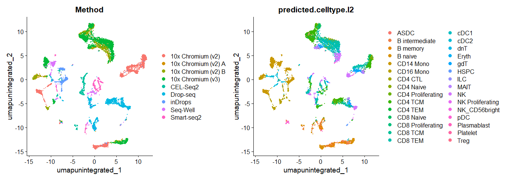
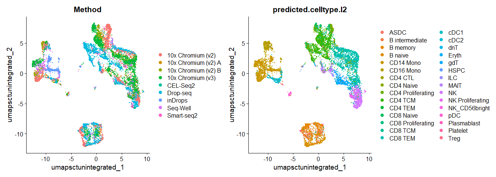
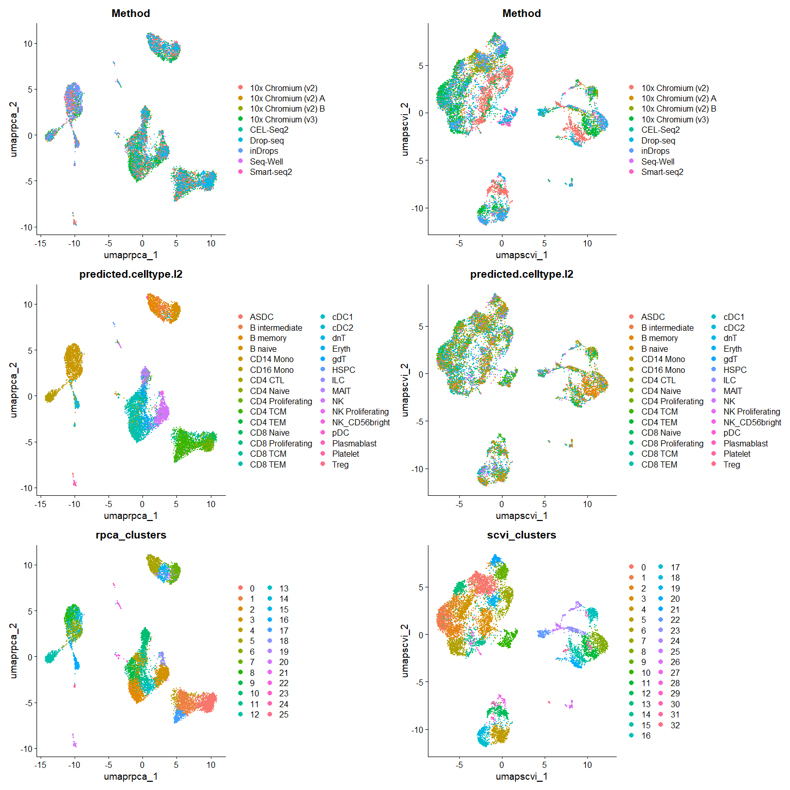
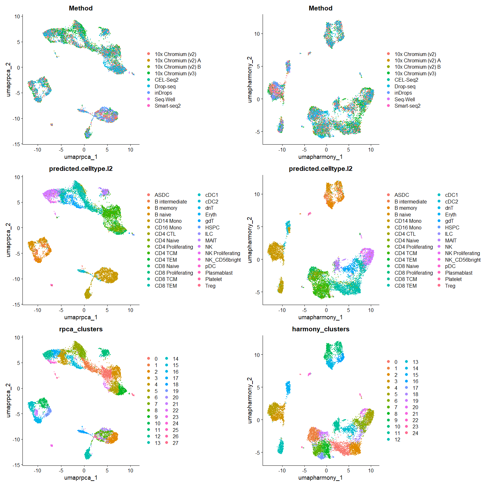

# Seurat tutorial 2 - pbmc multi-platform - Seurat v5 integrative
analysis with new SCTransform steps
Satija lab (original); Scot J Matkovich (notes + SCTransofrm edits)

# pbmcsca - Seurat v5 integrative analysis tutorial

Original sources: [R
markdown](https://github.com/satijalab/seurat/blob/HEAD/vignettes/seurat5_integration.Rmd)
and
[webpage](https://satijalab.org/seurat/articles/seurat5_integration.html).
The recommended new `sctransform` steps to replace `NormalizeData`,
`FindVariableFeatures` and `ScaleData` were derived in part from this [R
markdown](https://github.com/satijalab/seurat/blob/HEAD/vignettes/sctransform_vignette.Rmd)
and associated
[webpage](https://satijalab.org/seurat/articles/sctransform_vignette).

*Note Sep 2024*: On R 4.4.0/4.4.1 and Bioconductor 3.20, I had to
install the `SeuratWrappers` package via
`devtools::install_github ('satijalab/seurat-wrappers')`. Separately,
the `TFBSTools` package needed installation via
`BiocManager::install("TFBSTools")` to avoid an error when installing
the `Azimuth` package via
`devtools::install_github("satijalab/azimuth", "seurat5")` or via
`remotes::install_github("satijalab/azimuth", ref = "master")`
(master/main branch rather than seurat5 branch of the repo). I also had
to install `SeuratData` via
`remotes::install_github("satijalab/seurat-data", "seurat5", quiet = TRUE)`
as recommended at https://satijalab.org/seurat/articles/install.html

## Library load and output folder setup

``` r
library(Seurat)
library(SeuratData)
InstallData("pbmcsca", force.reinstall = F) # from SeuratData package reference
library(SeuratWrappers)
library(Azimuth)
library(dplyr)
library(gt) # gt (great tables) package
library(ggplot2)
library(patchwork)

library(reticulate)
source("R/scVI_pyvirtualenv.R")
# scVIIntegration using SeuratWrappers cannot access a Python virtualenv and requires a conda environment (Sep 2024)
# I modified the scVIIntegration function obtained from the SeuratWrappers Github repo to use a standard Python virtualenv instead

work.dir <- "C:/Downloads/"
if (!dir.exists(file.path(work.dir,"output"))) dir.create(file.path(work.dir,"output"))
```

### Import pre-calculated objects for visualization

If the compute-heavy steps in this notebook have already been run and
saved, this permits notebook rendering of visualizations. Otherwise, set
`eval: false` in the code chunk below and set `eval: true` throughout
this notebook as required.

<details class="code-fold">
<summary>Code to import previous objects</summary>

``` r
load(file.path(work.dir,"tut2_all-integrations-complete_both_objs_comp-viz.RData"))
```

</details>

## Introduction

Integration of single-cell sequencing datasets, for example across
experimental batches, donors, or conditions, is often an important step
in scRNA-seq workflows. Integrative analysis can help to match shared
cell types and states across datasets, which can boost statistical
power, and most importantly, facilitate accurate comparative analysis
across datasets. In previous versions of Seurat we introduced methods
for integrative analysis, including our ‘anchor-based’ integration
workflow. Many labs have also published powerful and pioneering methods,
including [Harmony](https://github.com/immunogenomics/harmony) and
[scVI](https://yoseflab.github.io/software/scvi-tools/), for integrative
analysis.

We recognize that while the goal of matching shared cell types across
datasets may be important for many problems, users may also be concerned
about which method to use, or that integration could result in a loss of
biological resolution. In Seurat v5, we introduce more flexible and
streamlined infrastructure to run different integration algorithms with
a single line of code. This makes it easier to explore the results of
different integration methods, and to compare these results to a
workflow that excludes integration steps. For this vignette, we use a
[dataset of human PBMC profiled with seven different
technologies](https://www.nature.com/articles/s41587-020-0465-8),
profiled as part of a systematic comparative analysis (`pbmcsca`). The
data is available as part of our
[SeuratData](https://github.com/satijalab/seurat-data) package.

## Layers in the Seurat v5 object

Seurat v5 assays store data in layers. These layers can store raw,
un-normalized counts (`layer='counts'`), normalized data
(`layer='data'`), or z-scored/variance-stabilized data
(`layer='scale.data'`). We can load in the data, remove low-quality
cells, and obtain predicted cell annotations (which will be useful for
assessing integration later), using our [Azimuth
pipeline](https://satijalab.github.io/azimuth/articles/run_azimuth_tutorial.html).

### Workflow notes

*Note Sep 2024*: The `Azimuth` resources enable cell annotation against
a reference for various human tissue sources. It would be of interest to
compare these against e.g. `SingleR` and to extend this work to
preclinical species. The initial cell annotations via `Azimuth` are used
to assist with evaluating integration of the datasets, but it would be
worth exploring whether cell annotation can be reasonably left until
after multi-platform / multi-‘batch’ integration.

<details class="code-fold">
<summary>Code to load pbmcsca and run Azimuth</summary>

``` r
# load in the pbmc comparative analysis dataset
obj <- LoadData("pbmcsca")
obj <- subset(obj, nFeature_RNA > 1000)
obj <- RunAzimuth(obj, reference = "pbmcref")

# currently, the object has two layers in the RNA assay: counts, and data
obj
# Layers(obj)
```

</details>

The object contains data from nine different batches (stored in the
`Method` column in the object metadata), representing seven different
technologies.

``` r
# make a nice table of obj$Method using gt package
method_summ <- table(obj$Method)
method_tb <- tibble(method = names(method_summ), cells = method_summ)
method_tb <- method_tb |>
  gt() |>
  tab_header(title = "Cells per batch") # A wide array of table decoration methods is available with gt

method_tb
```

<div id="yunxxhjxyg" style="padding-left:0px;padding-right:0px;padding-top:10px;padding-bottom:10px;overflow-x:auto;overflow-y:auto;width:auto;height:auto;">
<style>#yunxxhjxyg table {
  font-family: system-ui, 'Segoe UI', Roboto, Helvetica, Arial, sans-serif, 'Apple Color Emoji', 'Segoe UI Emoji', 'Segoe UI Symbol', 'Noto Color Emoji';
  -webkit-font-smoothing: antialiased;
  -moz-osx-font-smoothing: grayscale;
}
&#10;#yunxxhjxyg thead, #yunxxhjxyg tbody, #yunxxhjxyg tfoot, #yunxxhjxyg tr, #yunxxhjxyg td, #yunxxhjxyg th {
  border-style: none;
}
&#10;#yunxxhjxyg p {
  margin: 0;
  padding: 0;
}
&#10;#yunxxhjxyg .gt_table {
  display: table;
  border-collapse: collapse;
  line-height: normal;
  margin-left: auto;
  margin-right: auto;
  color: #333333;
  font-size: 16px;
  font-weight: normal;
  font-style: normal;
  background-color: #FFFFFF;
  width: auto;
  border-top-style: solid;
  border-top-width: 2px;
  border-top-color: #A8A8A8;
  border-right-style: none;
  border-right-width: 2px;
  border-right-color: #D3D3D3;
  border-bottom-style: solid;
  border-bottom-width: 2px;
  border-bottom-color: #A8A8A8;
  border-left-style: none;
  border-left-width: 2px;
  border-left-color: #D3D3D3;
}
&#10;#yunxxhjxyg .gt_caption {
  padding-top: 4px;
  padding-bottom: 4px;
}
&#10;#yunxxhjxyg .gt_title {
  color: #333333;
  font-size: 125%;
  font-weight: initial;
  padding-top: 4px;
  padding-bottom: 4px;
  padding-left: 5px;
  padding-right: 5px;
  border-bottom-color: #FFFFFF;
  border-bottom-width: 0;
}
&#10;#yunxxhjxyg .gt_subtitle {
  color: #333333;
  font-size: 85%;
  font-weight: initial;
  padding-top: 3px;
  padding-bottom: 5px;
  padding-left: 5px;
  padding-right: 5px;
  border-top-color: #FFFFFF;
  border-top-width: 0;
}
&#10;#yunxxhjxyg .gt_heading {
  background-color: #FFFFFF;
  text-align: center;
  border-bottom-color: #FFFFFF;
  border-left-style: none;
  border-left-width: 1px;
  border-left-color: #D3D3D3;
  border-right-style: none;
  border-right-width: 1px;
  border-right-color: #D3D3D3;
}
&#10;#yunxxhjxyg .gt_bottom_border {
  border-bottom-style: solid;
  border-bottom-width: 2px;
  border-bottom-color: #D3D3D3;
}
&#10;#yunxxhjxyg .gt_col_headings {
  border-top-style: solid;
  border-top-width: 2px;
  border-top-color: #D3D3D3;
  border-bottom-style: solid;
  border-bottom-width: 2px;
  border-bottom-color: #D3D3D3;
  border-left-style: none;
  border-left-width: 1px;
  border-left-color: #D3D3D3;
  border-right-style: none;
  border-right-width: 1px;
  border-right-color: #D3D3D3;
}
&#10;#yunxxhjxyg .gt_col_heading {
  color: #333333;
  background-color: #FFFFFF;
  font-size: 100%;
  font-weight: normal;
  text-transform: inherit;
  border-left-style: none;
  border-left-width: 1px;
  border-left-color: #D3D3D3;
  border-right-style: none;
  border-right-width: 1px;
  border-right-color: #D3D3D3;
  vertical-align: bottom;
  padding-top: 5px;
  padding-bottom: 6px;
  padding-left: 5px;
  padding-right: 5px;
  overflow-x: hidden;
}
&#10;#yunxxhjxyg .gt_column_spanner_outer {
  color: #333333;
  background-color: #FFFFFF;
  font-size: 100%;
  font-weight: normal;
  text-transform: inherit;
  padding-top: 0;
  padding-bottom: 0;
  padding-left: 4px;
  padding-right: 4px;
}
&#10;#yunxxhjxyg .gt_column_spanner_outer:first-child {
  padding-left: 0;
}
&#10;#yunxxhjxyg .gt_column_spanner_outer:last-child {
  padding-right: 0;
}
&#10;#yunxxhjxyg .gt_column_spanner {
  border-bottom-style: solid;
  border-bottom-width: 2px;
  border-bottom-color: #D3D3D3;
  vertical-align: bottom;
  padding-top: 5px;
  padding-bottom: 5px;
  overflow-x: hidden;
  display: inline-block;
  width: 100%;
}
&#10;#yunxxhjxyg .gt_spanner_row {
  border-bottom-style: hidden;
}
&#10;#yunxxhjxyg .gt_group_heading {
  padding-top: 8px;
  padding-bottom: 8px;
  padding-left: 5px;
  padding-right: 5px;
  color: #333333;
  background-color: #FFFFFF;
  font-size: 100%;
  font-weight: initial;
  text-transform: inherit;
  border-top-style: solid;
  border-top-width: 2px;
  border-top-color: #D3D3D3;
  border-bottom-style: solid;
  border-bottom-width: 2px;
  border-bottom-color: #D3D3D3;
  border-left-style: none;
  border-left-width: 1px;
  border-left-color: #D3D3D3;
  border-right-style: none;
  border-right-width: 1px;
  border-right-color: #D3D3D3;
  vertical-align: middle;
  text-align: left;
}
&#10;#yunxxhjxyg .gt_empty_group_heading {
  padding: 0.5px;
  color: #333333;
  background-color: #FFFFFF;
  font-size: 100%;
  font-weight: initial;
  border-top-style: solid;
  border-top-width: 2px;
  border-top-color: #D3D3D3;
  border-bottom-style: solid;
  border-bottom-width: 2px;
  border-bottom-color: #D3D3D3;
  vertical-align: middle;
}
&#10;#yunxxhjxyg .gt_from_md > :first-child {
  margin-top: 0;
}
&#10;#yunxxhjxyg .gt_from_md > :last-child {
  margin-bottom: 0;
}
&#10;#yunxxhjxyg .gt_row {
  padding-top: 8px;
  padding-bottom: 8px;
  padding-left: 5px;
  padding-right: 5px;
  margin: 10px;
  border-top-style: solid;
  border-top-width: 1px;
  border-top-color: #D3D3D3;
  border-left-style: none;
  border-left-width: 1px;
  border-left-color: #D3D3D3;
  border-right-style: none;
  border-right-width: 1px;
  border-right-color: #D3D3D3;
  vertical-align: middle;
  overflow-x: hidden;
}
&#10;#yunxxhjxyg .gt_stub {
  color: #333333;
  background-color: #FFFFFF;
  font-size: 100%;
  font-weight: initial;
  text-transform: inherit;
  border-right-style: solid;
  border-right-width: 2px;
  border-right-color: #D3D3D3;
  padding-left: 5px;
  padding-right: 5px;
}
&#10;#yunxxhjxyg .gt_stub_row_group {
  color: #333333;
  background-color: #FFFFFF;
  font-size: 100%;
  font-weight: initial;
  text-transform: inherit;
  border-right-style: solid;
  border-right-width: 2px;
  border-right-color: #D3D3D3;
  padding-left: 5px;
  padding-right: 5px;
  vertical-align: top;
}
&#10;#yunxxhjxyg .gt_row_group_first td {
  border-top-width: 2px;
}
&#10;#yunxxhjxyg .gt_row_group_first th {
  border-top-width: 2px;
}
&#10;#yunxxhjxyg .gt_summary_row {
  color: #333333;
  background-color: #FFFFFF;
  text-transform: inherit;
  padding-top: 8px;
  padding-bottom: 8px;
  padding-left: 5px;
  padding-right: 5px;
}
&#10;#yunxxhjxyg .gt_first_summary_row {
  border-top-style: solid;
  border-top-color: #D3D3D3;
}
&#10;#yunxxhjxyg .gt_first_summary_row.thick {
  border-top-width: 2px;
}
&#10;#yunxxhjxyg .gt_last_summary_row {
  padding-top: 8px;
  padding-bottom: 8px;
  padding-left: 5px;
  padding-right: 5px;
  border-bottom-style: solid;
  border-bottom-width: 2px;
  border-bottom-color: #D3D3D3;
}
&#10;#yunxxhjxyg .gt_grand_summary_row {
  color: #333333;
  background-color: #FFFFFF;
  text-transform: inherit;
  padding-top: 8px;
  padding-bottom: 8px;
  padding-left: 5px;
  padding-right: 5px;
}
&#10;#yunxxhjxyg .gt_first_grand_summary_row {
  padding-top: 8px;
  padding-bottom: 8px;
  padding-left: 5px;
  padding-right: 5px;
  border-top-style: double;
  border-top-width: 6px;
  border-top-color: #D3D3D3;
}
&#10;#yunxxhjxyg .gt_last_grand_summary_row_top {
  padding-top: 8px;
  padding-bottom: 8px;
  padding-left: 5px;
  padding-right: 5px;
  border-bottom-style: double;
  border-bottom-width: 6px;
  border-bottom-color: #D3D3D3;
}
&#10;#yunxxhjxyg .gt_striped {
  background-color: rgba(128, 128, 128, 0.05);
}
&#10;#yunxxhjxyg .gt_table_body {
  border-top-style: solid;
  border-top-width: 2px;
  border-top-color: #D3D3D3;
  border-bottom-style: solid;
  border-bottom-width: 2px;
  border-bottom-color: #D3D3D3;
}
&#10;#yunxxhjxyg .gt_footnotes {
  color: #333333;
  background-color: #FFFFFF;
  border-bottom-style: none;
  border-bottom-width: 2px;
  border-bottom-color: #D3D3D3;
  border-left-style: none;
  border-left-width: 2px;
  border-left-color: #D3D3D3;
  border-right-style: none;
  border-right-width: 2px;
  border-right-color: #D3D3D3;
}
&#10;#yunxxhjxyg .gt_footnote {
  margin: 0px;
  font-size: 90%;
  padding-top: 4px;
  padding-bottom: 4px;
  padding-left: 5px;
  padding-right: 5px;
}
&#10;#yunxxhjxyg .gt_sourcenotes {
  color: #333333;
  background-color: #FFFFFF;
  border-bottom-style: none;
  border-bottom-width: 2px;
  border-bottom-color: #D3D3D3;
  border-left-style: none;
  border-left-width: 2px;
  border-left-color: #D3D3D3;
  border-right-style: none;
  border-right-width: 2px;
  border-right-color: #D3D3D3;
}
&#10;#yunxxhjxyg .gt_sourcenote {
  font-size: 90%;
  padding-top: 4px;
  padding-bottom: 4px;
  padding-left: 5px;
  padding-right: 5px;
}
&#10;#yunxxhjxyg .gt_left {
  text-align: left;
}
&#10;#yunxxhjxyg .gt_center {
  text-align: center;
}
&#10;#yunxxhjxyg .gt_right {
  text-align: right;
  font-variant-numeric: tabular-nums;
}
&#10;#yunxxhjxyg .gt_font_normal {
  font-weight: normal;
}
&#10;#yunxxhjxyg .gt_font_bold {
  font-weight: bold;
}
&#10;#yunxxhjxyg .gt_font_italic {
  font-style: italic;
}
&#10;#yunxxhjxyg .gt_super {
  font-size: 65%;
}
&#10;#yunxxhjxyg .gt_footnote_marks {
  font-size: 75%;
  vertical-align: 0.4em;
  position: initial;
}
&#10;#yunxxhjxyg .gt_asterisk {
  font-size: 100%;
  vertical-align: 0;
}
&#10;#yunxxhjxyg .gt_indent_1 {
  text-indent: 5px;
}
&#10;#yunxxhjxyg .gt_indent_2 {
  text-indent: 10px;
}
&#10;#yunxxhjxyg .gt_indent_3 {
  text-indent: 15px;
}
&#10;#yunxxhjxyg .gt_indent_4 {
  text-indent: 20px;
}
&#10;#yunxxhjxyg .gt_indent_5 {
  text-indent: 25px;
}
&#10;#yunxxhjxyg .katex-display {
  display: inline-flex !important;
  margin-bottom: 0.75em !important;
}
&#10;#yunxxhjxyg div.Reactable > div.rt-table > div.rt-thead > div.rt-tr.rt-tr-group-header > div.rt-th-group:after {
  height: 0px !important;
}
</style>

| Cells per batch     |       |
|---------------------|-------|
| method              | cells |
| 10x Chromium (v2)   | 2172  |
| 10x Chromium (v2) A | 844   |
| 10x Chromium (v2) B | 831   |
| 10x Chromium (v3)   | 2866  |
| CEL-Seq2            | 504   |
| Drop-seq            | 1810  |
| inDrops             | 545   |
| Seq-Well            | 350   |
| Smart-seq2          | 512   |

</div>

We will aim to integrate the different batches together. In previous
versions of Seurat, we would require the data to be represented as nine
different Seurat objects. When using Seurat v5 assays, we can instead
keep all the data in one object, but simply split the layers. After
splitting, there are now 18 layers (a counts and data layer for each
batch). We can also run a standard scRNA-seq analysis (i.e. without
integration). Note that since the data is split into layers,
normalization and variable feature identification is performed for each
batch independently (a consensus set of variable features is
automatically identified).

*Question* for future work: how can separate count objects (e.g. from
different samples or assays) be loaded directly into a Seurat v5 object
as layers, ready for later integration work, rather than import of a
single object with subsequent splitting? Is this simply using the
[‘merge’
function](https://satijalab.org/seurat/articles/essential_commands#merge-objects-without-integration)?

``` r
obj[["RNA"]] <- split(obj[["RNA"]], f = obj$Method)
obj

# the non-SCTransform, 'standard' version of the layer normalization
obj_std <- NormalizeData(obj)
obj_std <- FindVariableFeatures(obj_std)
obj_std <- ScaleData(obj_std)
obj_std <- RunPCA(obj_std)

# the SCTransform version of layer normalization
options(future.globals.maxSize = 3e+09)
obj_sct <- SCTransform(obj)
# the "scale.data" layer as used in obj_std[["RNA]]] is now placed in obj_sct[["SCT"]]
obj_sct <- RunPCA(obj_sct, npcs = 30, verbose = F)
```

We can now visualize the results of a standard analysis without
integration. Note that cells are grouping both by cell type and by
underlying method. While a UMAP analysis is just a visualization of
this, clustering this dataset would retuobjrn predominantly
batch-specific clusters. Especially if previous cell-type annotations
were not available, this would make downstream analysis extremely
challenging.

``` r
obj_std <- FindNeighbors(obj_std, dims = 1:30, reduction = "pca")
obj_std <- FindClusters(obj_std, resolution = 2, cluster.name = "unintegrated_clusters")
obj_std <- RunUMAP(obj_std, dims = 1:30, reduction = "pca", reduction.name = "umap.unintegrated")
```

``` r
# make summary plots colored by batch or by cell type annotation (predicted.celltype)
# cell type annotations were previously added by Azimuth
DimPlot(obj_std, reduction = "umap.unintegrated", group.by = c("Method", "predicted.celltype.l2"))
```



Interestingly, the use of the SCTransform procedure for normalization
and scaling produces transformed, unintegrated data with less platform
dependency apparent on initial UMAP plots.

``` r
obj_sct <- FindNeighbors(obj_sct, dims = 1:30, reduction = "pca")
obj_sct <- FindClusters(obj_sct, resolution = 2, cluster.name = "unintegrated_sct_clusters")
obj_sct <- RunUMAP(obj_sct, dims = 1:30, reduction = "pca", reduction.name = "umap.sct.unintegrated")
```

``` r
# make summary plots colored by batch or by cell type annotation (predicted.celltype)
# cell type annotations were previously added by Azimuth
DimPlot(obj_sct, reduction = "umap.sct.unintegrated", group.by = c("Method", "predicted.celltype.l2"))
```



## Easy single-command code for integrative analyses in Seurat v5

Seurat v5 enables streamlined integrative analysis using the
`IntegrateLayers` function. The method currently supports five
integration methods. Each of these methods performs integration in
low-dimensional space, and returns a dimensional reduction
(i.e. `integrated.rpca`) that aims to co-embed shared cell types across
batches:

- Anchor-based CCA integration (`method=CCAIntegration`)
- Anchor-based RPCA integration (`method=RPCAIntegration`)
- Harmony (`method=HarmonyIntegration`)
- FastMNN (`method= FastMNNIntegration`)
- scVI (`method=scVIIntegration`)

Note that our anchor-based RPCA integration represents a faster and more
conservative (less correction) method for integration. For interested
users, we discuss this method in more detail in our [previous RPCA
vignette](https://satijalab.org/seurat/articles/integration_rpca)

You can find more detail on each method, and any installation
prerequisites, in Seurat’s documentation (for example,
`?scVIIntegration`). For example, scVI integration requires `reticulate`
which can be installed from CRAN (`install.packages("reticulate")`) as
well as `scanpy` and `scvi-tools` and their dependencies installed in a
virtualenv or conda environment. Please see scVI installation
instructions
[here](https://docs.scvi-tools.org/en/stable/installation.html).

*Note*: the `SeuratWrappers` bundle of R functions available Sep 2024
only permitted `scVIIntegration` to use a conda environment. I modified
this Sep 2024 to use a standard Python virtualenv instead, sourced the
new function at the start of this notebook, and employed it here.

### Standard normalization

Each of the following lines perform a new integration using a single
function call (on the data normalized with the pre-SCTransform methods
in `obj`):

``` r
options(future.globals.maxSize = 3e+09)

obj_std <- IntegrateLayers(
  object = obj_std, method = FastMNNIntegration,
  new.reduction = 'integrated.mnn',
  verbose = FALSE)

obj_std <- IntegrateLayers(
  object = obj_std, method = CCAIntegration,
  orig.reduction = "pca", new.reduction = 'integrated.cca',
  verbose = FALSE)

obj_std <- IntegrateLayers(
  object = obj_std, method = RPCAIntegration,
  orig.reduction = "pca", new.reduction = 'integrated.rpca',
  verbose = FALSE)

obj_std <- IntegrateLayers(
  object = obj_std, method = HarmonyIntegration,
  orig.reduction = "pca", new.reduction = 'harmony',
  verbose = FALSE)

# obj_std <- IntegrateLayers(
#   object = obj_std, method = scVIIntegration,
#   new.reduction = "integrated.scvi",
#   virtual_env = "C:/Users/sjmat/venv_compbio",
#   verbose = FALSE
# )
```

Note that `scVIIntegration` may require substantial runtime compared to
the other methods. A process for incorporating the cell embeddings from
a previously prepared run of `scVIIntegration` into the `obj` used for
visualizations is as follows:

``` r
scvi.reduc <- Embeddings(readRDS(file.path(work.dir, "output/pbmcsca_split_std_integr_scvi_only.rds")), reduction="integrated.scvi") # extracts a matrix of embeddings
scvi.reduc <- scvi.reduc[Cells(obj_std),] # ensures matrix corresponds to cell names in `obj`
obj_std[["integrated.scvi"]] <- CreateDimReducObject(embeddings = scvi.reduc)
```

### SCTransform normalization

The following code block will do the same, this time using the
SCTransform-normalized layers in `obj_sct`.  

*Notes Sep 2024*:

Are SCTransform-normalized layers compatible with `FastMNNIntegration`?
Error concerning mismatch of row numbers when executing.

It may be also that the implementation of `scvi-tools` from the
`SeuratWrappers` function bundle doesn’t yet allow for the use of
SCTransform-normalized data (Sep 2024), so I have commented out the
relevant `scVIIntegration` lines. There’s a note in the Github code that
hard-coded assay types are used, which may be the problem, and which are
noted as ‘to-dos’ for fixing.

<details class="code-fold">
<summary>Code for SCT object layer integration</summary>

``` r
options(future.globals.maxSize = 6e+09)

# obj_sct <- IntegrateLayers(
#   object = obj_sct, method = FastMNNIntegration,
#   normalization.method = "SCT",
#   orig.reduction = "pca", new.reduction = 'integrated.mnn',
#   verbose = FALSE)

obj_sct <- IntegrateLayers(
  object = obj_sct, method = CCAIntegration,
  normalization.method = "SCT",
  orig.reduction = "pca", new.reduction = 'integrated.cca',
  verbose = FALSE)

obj_sct <- IntegrateLayers(
  object = obj_sct, method = RPCAIntegration,
  normalization.method = "SCT",
  orig.reduction = "pca", new.reduction = 'integrated.rpca',
  verbose = FALSE)

obj_sct <- IntegrateLayers(
  object = obj_sct, method = HarmonyIntegration,
  normalization.method = "SCT",
  orig.reduction = "pca", new.reduction = 'harmony',
  verbose = FALSE)

# obj_sct <- IntegrateLayers(
#   object = obj_sct, method = scVIIntegration,
#   normalization.method = "SCT",
#   new.reduction = "integrated.scvi",
#   virtual_env = "C:/Users/sjmat/venv_compbio",
#   verbose = FALSE)
```

</details>
<!-- # ```{r} -->
<!-- # #| label: incorporate_previous_sct_scvi -->
<!-- # #| echo: true -->
<!-- # #| eval: false -->
<!-- # #| message: false -->
<!-- # #| code-copy: true -->
<!-- #  -->
<!-- # scvi.reduc.sct <- Embeddings(readRDS(file.path(work.dir, "output/pbmcsca_split_sct_integr_scvi_only.rds")), reduction="integrated.scvi") # extracts a matrix of embeddings -->
<!-- # scvi.reduc.sct <- scvi.reduc.sct[Cells(obj_sct),] # ensures matrix corresponds to cell names in `obj` -->
<!-- # obj_sct[["integrated.scvi"]] <- CreateDimReducObject(embeddings = scvi.reduc.sct) -->
<!-- # ``` -->

## Visualize layer integration results

First example: compare outputs of `RPCA` and `scvi` methods for data
normalized with standard methods (`obj_std`)

``` r
# RPCA clusters
obj_std <- FindNeighbors(obj_std, reduction = "integrated.rpca", dims = 1:30)
obj_std <- FindClusters(obj_std, resolution = 2, cluster.name = "rpca_clusters")
obj_std <- RunUMAP(obj_std, reduction = "integrated.rpca", dims = 1:30, reduction.name = "umap.rpca")

# scvi clusters
obj_std <- FindNeighbors(obj_std, reduction = "integrated.scvi", dims = 1:30)
obj_std <- FindClusters(obj_std, resolution = 2, cluster.name = "scvi_clusters")
obj_std <- RunUMAP(obj_std, reduction = "integrated.scvi", dims = 1:30, reduction.name = "umap.scvi")
```

Plots to compare above methods for `obj_std`

``` r
p1 <- DimPlot(
  obj_std,
  reduction = "umap.rpca",
  group.by = c("Method", "predicted.celltype.l2", "rpca_clusters"),
  combine = FALSE, label.size = 2
)

p2 <- DimPlot(
  obj_std,
  reduction = "umap.scvi",
  group.by = c("Method", "predicted.celltype.l2", "scvi_clusters"),
  combine = FALSE, label.size = 2
)

wrap_plots(c(p1, p2), ncol = 2, byrow = F)
```



Second example: compare outputs of `RPCA` and `harmony` methods for data
normalized with SCTransform (`obj_sct`)

``` r
# RPCA clusters
obj_sct <- FindNeighbors(obj_sct, reduction = "integrated.rpca", dims = 1:30)
obj_sct <- FindClusters(obj_sct, resolution = 2, cluster.name = "rpca_clusters")
obj_sct <- RunUMAP(obj_sct, reduction = "integrated.rpca", dims = 1:30, reduction.name = "umap.rpca")

# scvi clusters
obj_sct <- FindNeighbors(obj_sct, reduction = "harmony", dims = 1:30)
obj_sct <- FindClusters(obj_sct, resolution = 2, cluster.name = "harmony_clusters")
obj_sct <- RunUMAP(obj_sct, reduction = "harmony", dims = 1:30, reduction.name = "umap.harmony")
```

Plots to compare above methods for `obj_sct`

``` r
p3 <- DimPlot(
  obj_sct,
  reduction = "umap.rpca",
  group.by = c("Method", "predicted.celltype.l2", "rpca_clusters"),
  combine = FALSE, label.size = 2
)

p4 <- DimPlot(
  obj_sct,
  reduction = "umap.harmony",
  group.by = c("Method", "predicted.celltype.l2", "harmony_clusters"),
  combine = FALSE, label.size = 2
)

wrap_plots(c(p3, p4), ncol = 2, byrow = F)
```



## Choose which dimension reduction to use for joining layers prior to further analyses

After examining plots, choose a dimension reduction method to use for
(re)joining layers and proceeding to pseudobulk aggregation and DE etc.

``` r
obj_std_scvi <- JoinLayers(obj_std, reduction="integrated.scvi")

obj_sct_rpca <- JoinLayers(obj_sct, reduction="integrated.rpca")
```

<details>
<summary>
**Session Info**
</summary>

``` r
sessionInfo()
```

    R version 4.4.0 (2024-04-24 ucrt)
    Platform: x86_64-w64-mingw32/x64
    Running under: Windows 11 x64 (build 22631)

    Matrix products: default


    locale:
    [1] LC_COLLATE=English_United States.utf8 
    [2] LC_CTYPE=English_United States.utf8   
    [3] LC_MONETARY=English_United States.utf8
    [4] LC_NUMERIC=C                          
    [5] LC_TIME=English_United States.utf8    

    time zone: America/Indianapolis
    tzcode source: internal

    attached base packages:
    [1] stats     graphics  grDevices utils     datasets  methods   base     

    other attached packages:
     [1] reticulate_1.39.0        patchwork_1.3.0          ggplot2_3.5.1           
     [4] gt_0.11.0                dplyr_1.1.4              Azimuth_0.5.0           
     [7] shinyBS_0.61.1           SeuratWrappers_0.3.5     pbmcsca.SeuratData_3.0.0
    [10] pbmcref.SeuratData_1.0.0 SeuratData_0.2.2.9001    Seurat_5.1.0            
    [13] SeuratObject_5.0.2       sp_2.1-4                

    loaded via a namespace (and not attached):
      [1] fs_1.6.4                          ProtGenerics_1.37.1              
      [3] matrixStats_1.4.1                 spatstat.sparse_3.1-0            
      [5] bitops_1.0-8                      DirichletMultinomial_1.47.0      
      [7] TFBSTools_1.43.0                  httr_1.4.7                       
      [9] RColorBrewer_1.1-3                tools_4.4.0                      
     [11] sctransform_0.4.1                 utf8_1.2.4                       
     [13] R6_2.5.1                          DT_0.33                          
     [15] lazyeval_0.2.2                    uwot_0.2.2                       
     [17] rhdf5filters_1.17.0               withr_3.0.1                      
     [19] gridExtra_2.3                     progressr_0.14.0                 
     [21] cli_3.6.3                         Biobase_2.65.1                   
     [23] spatstat.explore_3.3-2            fastDummies_1.7.4                
     [25] EnsDb.Hsapiens.v86_2.99.0         shinyjs_2.1.0                    
     [27] labeling_0.4.3                    sass_0.4.9                       
     [29] spatstat.data_3.1-2               readr_2.1.5                      
     [31] ggridges_0.5.6                    pbapply_1.7-2                    
     [33] Rsamtools_2.21.1                  R.utils_2.12.3                   
     [35] parallelly_1.38.0                 BSgenome_1.73.1                  
     [37] rstudioapi_0.16.0                 RSQLite_2.3.7                    
     [39] generics_0.1.3                    BiocIO_1.15.2                    
     [41] gtools_3.9.5                      ica_1.0-3                        
     [43] spatstat.random_3.3-2             googlesheets4_1.1.1              
     [45] GO.db_3.19.1                      Matrix_1.7-0                     
     [47] fansi_1.0.6                       S4Vectors_0.43.2                 
     [49] abind_1.4-8                       R.methodsS3_1.8.2                
     [51] lifecycle_1.0.4                   yaml_2.3.10                      
     [53] SummarizedExperiment_1.35.1       rhdf5_2.49.0                     
     [55] SparseArray_1.5.36                Rtsne_0.17                       
     [57] grid_4.4.0                        blob_1.2.4                       
     [59] promises_1.3.0                    shinydashboard_0.7.2             
     [61] crayon_1.5.3                      pwalign_1.1.0                    
     [63] miniUI_0.1.1.1                    lattice_0.22-6                   
     [65] cowplot_1.1.3                     annotate_1.83.0                  
     [67] GenomicFeatures_1.57.0            KEGGREST_1.45.1                  
     [69] pillar_1.9.0                      knitr_1.48                       
     [71] GenomicRanges_1.57.1              rjson_0.2.23                     
     [73] future.apply_1.11.2               codetools_0.2-20                 
     [75] fastmatch_1.1-4                   leiden_0.4.3.1                   
     [77] glue_1.7.0                        spatstat.univar_3.0-1            
     [79] data.table_1.16.0                 remotes_2.5.0                    
     [81] vctrs_0.6.5                       png_0.1-8                        
     [83] spam_2.10-0                       cellranger_1.1.0                 
     [85] poweRlaw_0.80.0                   gtable_0.3.5                     
     [87] cachem_1.1.0                      xfun_0.47                        
     [89] Signac_1.14.0                     S4Arrays_1.5.7                   
     [91] mime_0.12                         pracma_2.4.4                     
     [93] survival_3.7-0                    gargle_1.5.2                     
     [95] RcppRoll_0.3.1                    fitdistrplus_1.2-1               
     [97] ROCR_1.0-11                       nlme_3.1-166                     
     [99] bit64_4.0.5                       RcppAnnoy_0.0.22                 
    [101] GenomeInfoDb_1.41.1               irlba_2.3.5.1                    
    [103] KernSmooth_2.23-24                SeuratDisk_0.0.0.9021            
    [105] colorspace_2.1-1                  seqLogo_1.71.0                   
    [107] BiocGenerics_0.51.1               DBI_1.2.3                        
    [109] tidyselect_1.2.1                  bit_4.0.5                        
    [111] compiler_4.4.0                    curl_5.2.2                       
    [113] hdf5r_1.3.11                      xml2_1.3.6                       
    [115] DelayedArray_0.31.11              plotly_4.10.4                    
    [117] rtracklayer_1.65.0                scales_1.3.0                     
    [119] caTools_1.18.3                    lmtest_0.9-40                    
    [121] rappdirs_0.3.3                    stringr_1.5.1                    
    [123] digest_0.6.37                     goftest_1.2-3                    
    [125] presto_1.0.0                      spatstat.utils_3.1-0             
    [127] rmarkdown_2.28                    XVector_0.45.0                   
    [129] htmltools_0.5.8.1                 pkgconfig_2.0.3                  
    [131] MatrixGenerics_1.17.0             fastmap_1.2.0                    
    [133] ensembldb_2.29.1                  rlang_1.1.4                      
    [135] htmlwidgets_1.6.4                 UCSC.utils_1.1.0                 
    [137] shiny_1.9.1                       farver_2.1.2                     
    [139] zoo_1.8-12                        jsonlite_1.8.8                   
    [141] BiocParallel_1.39.0               R.oo_1.26.0                      
    [143] RCurl_1.98-1.16                   magrittr_2.0.3                   
    [145] GenomeInfoDbData_1.2.12           dotCall64_1.1-1                  
    [147] Rhdf5lib_1.27.0                   munsell_0.5.1                    
    [149] Rcpp_1.0.13                       stringi_1.8.4                    
    [151] zlibbioc_1.51.1                   MASS_7.3-61                      
    [153] plyr_1.8.9                        parallel_4.4.0                   
    [155] listenv_0.9.1                     ggrepel_0.9.6                    
    [157] deldir_2.0-4                      CNEr_1.41.0                      
    [159] Biostrings_2.73.1                 splines_4.4.0                    
    [161] tensor_1.5                        hms_1.1.3                        
    [163] BSgenome.Hsapiens.UCSC.hg38_1.4.5 igraph_2.0.3                     
    [165] spatstat.geom_3.3-3               RcppHNSW_0.6.0                   
    [167] reshape2_1.4.4                    stats4_4.4.0                     
    [169] TFMPvalue_0.0.9                   XML_3.99-0.17                    
    [171] evaluate_1.0.0                    BiocManager_1.30.25              
    [173] JASPAR2020_0.99.10                tzdb_0.4.0                       
    [175] httpuv_1.6.15                     RANN_2.6.2                       
    [177] tidyr_1.3.1                       purrr_1.0.2                      
    [179] polyclip_1.10-7                   future_1.34.0                    
    [181] scattermore_1.2                   rsvd_1.0.5                       
    [183] xtable_1.8-4                      restfulr_0.0.15                  
    [185] AnnotationFilter_1.29.0           RSpectra_0.16-2                  
    [187] later_1.3.2                       googledrive_2.1.1                
    [189] viridisLite_0.4.2                 tibble_3.2.1                     
    [191] memoise_2.0.1                     AnnotationDbi_1.67.0             
    [193] GenomicAlignments_1.41.0          IRanges_2.39.2                   
    [195] cluster_2.1.6                     globals_0.16.3                   

</details>
